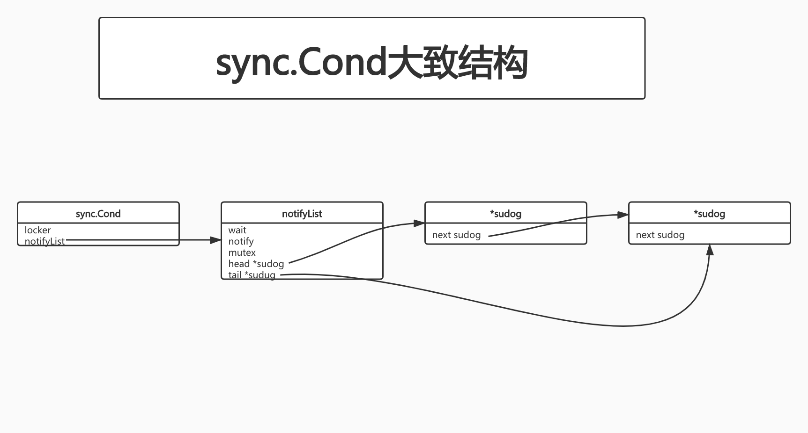

# 深入理解sync.Cond

[原文出处](https://zhuanlan.zhihu.com/p/351776260)

## 1. 基本用法

基本用法刚才已经讲过,此处举一个实际的例子:实现一个FIFO的队列

```go
package main

import (
	"fmt"
	"math/rand"
	"os"
	"os/signal"
	"sync"
	"time"
)

type FIFO struct {
	lock sync.Mutex
	cond *sync.Cond
	queue []int
}

type Queue interface {
	Pop() int
	Offer(num int) error
}

func (f *FIFO) Offer(num int) error {
	f.lock.Lock()
	defer f.lock.Unlock()
	f.queue = append(f.queue, num)
	// 每向队列中添加1个元素 向所有Pop的goroutine广播1次
	f.cond.Broadcast()
	return nil
}

func (f *FIFO) Pop() int {
	f.lock.Lock()
	defer f.lock.Unlock()

	for len(f.queue) == 0 {
		f.cond.Wait()
	}

	item := f.queue[0]
	f.queue = f.queue[1:]
	return item
}

func main() {
	l := sync.Mutex{}
	fifo := &FIFO{
		lock: l,
		cond: sync.NewCond(&l),
		queue: []int{},
	}

	// 持续向队列投放数据
	go func() {
		for {
			fifo.Offer(rand.Int())
		}
	}()

	time.Sleep(1 * time.Second)

	// 持续从队列拿取数据
	go func() {
		for {
			fmt.Println(fmt.Sprintf("goroutine1 pop --> %d", fifo.Pop()))
		}
	}()

	// 持续从队列拿取数据
	go func() {
		for {
			fmt.Println(fmt.Sprintf("goroutine2 pop --> %d", fifo.Pop()))
		}
	}()

	ch := make(chan os.Signal, 1)
	signal.Notify(ch, os.Interrupt)
	<-ch
}
```

定义一个FIFO的队列,有`Offer`和`Pop`2个操作.起一个goroutine不断向队列投放数据,起2个goroutine不断从队列中拿取数据

1. `Pop`操作会判断,如果队列中没有数据,则调用`f.cond.Wait()`将goroutine挂起
2. `Offer`操作投放数据成功,调用`f.cond.Broadcast`来唤醒所有挂起在这个`mutex`上的goroutine.

总结`sync.Cond`的大致用法:

1. 首先声明一个`mutex`,此处`sync.Mutex`或`sync.RWMutex`可根据实际情况选用
2. 调用`sync.NewCond(l locker) *Cond`.此处入参传指针是为了避免`c.L.Lock()`和`c.L.Unlock()`频繁调用,导致死锁.(TODO:为什么频繁调用会导致死锁?)
3. 根据业务条件,不满足条件则调用`cond.Wait()`挂起goroutine
4. `cond.Broadcast()`唤起所有挂起的gorotune;另一个方法`cond.Signal()`唤醒一个最先挂起的goroutine

需要注意的是:`cond.Wait()`的使用需要参照如下模版

```go
c.L.Lock()
for !condition() {
    c.Wait()
}
... make use of condition ...
c.L.Unlock()
```

## 2.源码分析

### 2.1 数据结构

`sync.Cond`的数据结构:

```go
type Cond struct {
	// Cond使用后不允许拷贝
	noCopy noCopy

	// L is held while observing or changing the condition
	L Locker

	// 通知列表调用Wait()方法的goroutine会被放到notifyList中
	notify  notifyList
	
	// 检查Cond实例是否被复制
	checker copyChecker
}
```

`noCopy`保证`Cond`使用后不允许拷贝;

`Locker`即为`mutex`

`copyChecker`是用来检查`Cond`实例是否被复制的,只有1个方法:

```go
func (c *copyChecker) check() {
	if uintptr(*c) != uintptr(unsafe.Pointer(c)) &&
		!atomic.CompareAndSwapUintptr((*uintptr)(c), 0, uintptr(unsafe.Pointer(c))) &&
		uintptr(*c) != uintptr(unsafe.Pointer(c)) {
		panic("sync.Cond is copied")
	}
}
```

大致意思是说:初始`type copyChecker uintptr`默认为0,第1次调用`check()`会将`copyChecker`自身的地址复制给自己.

`uintptr(*c) != uintptr(unsafe.Pointer(c))`被调用2次,是因为在`atomic.CompareAndSwapUintptr((*uintptr)(c), 0, uintptr(unsafe.Pointer(c)))`的运行期间,goroutine可能已经改变了`copyChecker`.两次调用若不相等,则说明`sync.Cond`被复制,重新分配了内存地址.

`notifyList`的数据结构:

```go
type notifyList struct {
	// wait is the ticket number of the next waiter. It is atomically
	// incremented outside the lock.
	// 被挂起的goroutine的数量
	wait uint32

	// notify is the ticket number of the next waiter to be notified. It can
	// be read outside the lock, but is only written to with lock held.
	//
	// Both wait & notify can wrap around, and such cases will be correctly
	// handled as long as their "unwrapped" difference is bounded by 2^31.
	// For this not to be the case, we'd need to have 2^31+ goroutines
	// blocked on the same condvar, which is currently not possible.
	// 唤醒goroutine操作的数量
	notify uint32

	// List of parked waiters.
	lock mutex
	head *sudog
	tail *sudog
}
```

包含了3类字段:

- `wait`和`notify`是2个uint32,分别表示了`Wait()`操作的次数和goroutine被唤醒的次数,`wait`应该恒大于`notify`
- `lock mutex`并不是GO提供开发者使用的`sync.Mutex`,而是系统内部运行时实现的一个简单版本的互斥锁
- `head`和`tail`看名字猜测就觉得和链表很像.这里就是维护了阻塞在当前`sync.Cond`上的goroutine构成的链表



### 2.2 操作方法

`Wait()`操作:

```go
func (c *Cond) Wait() {
	// 1. 检查cond是否被拷贝
	c.checker.check()
	
	// 2. notifyList.wait + 1
	t := runtime_notifyListAdd(&c.notify)
	
	// 3. 释放锁 让出资源给其他goroutine
	c.L.Unlock()
	
	// 挂起goroutine
	runtime_notifyListWait(&c.notify, t)
	
	// 尝试获取锁
	c.L.Lock()
}
```

从`Wait()`方法源码很容易看出它的操作大概分了5步:

- 1. 调用`copyChecker.check()`保证`sync.Cond`不会被拷贝
- 2. 每次调用`Wait()`会将`sync.Cond.notifyList.wait`属性进行+1操作,这也是它能够确保我们例子中`FIFO`的基石.根据`wait`来判断goroutine等待的顺序
- 3. 调用`c.L.Unlock()`因为当前goroutine即将被gopark(协程切换),让出锁给其他goroutine避免死锁
- 4. 调用`runtime_notifyListWait(&c.notify, t)`

	
```go
	//go:linkname notifyListAdd sync.runtime_notifyListAdd
func notifyListAdd(l *notifyList) uint32 {
	// This may be called concurrently, for example, when called from
	// sync.Cond.Wait while holding a RWMutex in read mode.
	return atomic.Xadd(&l.wait, 1) - 1
}
```

```go
// notifyListWait waits for a notification. If one has been sent since
// notifyListAdd was called, it returns immediately. Otherwise, it blocks.
//go:linkname notifyListWait sync.runtime_notifyListWait
func notifyListWait(l *notifyList, t uint32) {
	lockWithRank(&l.lock, lockRankNotifyList)

	// Return right away if this ticket has already been notified.
	
	// 如果当前goroutine已经被唤醒 则立即返回
	if less(t, l.notify) {
		unlock(&l.lock)
		return
	}

	// Enqueue itself.
	s := acquireSudog()
	s.g = getg()
	
	// 把等待递增序号(即notifyList.wait)赋值给sudog.ticket 以便能够实现FIFO的特性
	s.ticket = t
	s.releasetime = 0
	t0 := int64(0)
	if blockprofilerate > 0 {
		t0 = cputicks()
		s.releasetime = -1
	}
	
	// 将当前goroutine插入到notifyList链表中
	if l.tail == nil {
		l.head = s
	} else {
		l.tail.next = s
	}
	l.tail = s
	
	// 调用gopark挂起当前goroutine
	goparkunlock(&l.lock, waitReasonSyncCondWait, traceEvGoBlockCond, 3)
	if t0 != 0 {
		blockevent(s.releasetime-t0, 2)
	}
	
	// goroutine被唤醒后释放sudog
	releaseSudog(s)
}
```
	
实际上主要完成了2个任务:
	
1. 将当前goroutine插入到notifyList链表中
2. 调用gopark将当前goroutine挂起

- 5. 当其他goroutine调用了`Signal`或`Broadcast`方法时,当前goroutine被唤醒后再次尝试获得锁

`Signal`操作:

`Signal`唤醒一个等待时间最长的goroutine,调用时不要求持有锁

```go
func (c *Cond) Signal() {
	c.checker.check()
	runtime_notifyListNotifyOne(&c.notify)
}
```

具体实现即为:

1. 先判断`sync.Cond`是否被复制
2. 然后调用`runtime_notifyListNotifyOne`

```go
// notifyListNotifyOne notifies one entry in the list.
//go:linkname notifyListNotifyOne sync.runtime_notifyListNotifyOne
func notifyListNotifyOne(l *notifyList) {
	// Fast-path: if there are no new waiters since the last notification
	// we don't need to acquire the lock at all.
	
	// wait == notify 说明没有等待的goroutine了
	if atomic.Load(&l.wait) == atomic.Load(&l.notify) {
		return
	}

	lockWithRank(&l.lock, lockRankNotifyList)

	// Re-check under the lock if we need to do anything.
	
	// 二次检查
	t := l.notify
	if t == atomic.Load(&l.wait) {
		unlock(&l.lock)
		return
	}

	// Update the next notify ticket number.
	
	// 更新下一个需要被唤醒的ticket number
	atomic.Store(&l.notify, t+1)

	// Try to find the g that needs to be notified.
	// If it hasn't made it to the list yet we won't find it,
	// but it won't park itself once it sees the new notify number.
	//
	// This scan looks linear but essentially always stops quickly.
	// Because g's queue separately from taking numbers,
	// there may be minor reorderings in the list, but we
	// expect the g we're looking for to be near the front.
	// The g has others in front of it on the list only to the
	// extent that it lost the race, so the iteration will not
	// be too long. This applies even when the g is missing:
	// it hasn't yet gotten to sleep and has lost the race to
	// the (few) other g's that we find on the list.
	
	// 此处是FIFO实现的核心 其实就是遍历链表 sodug.ticket查找指定需要唤醒的节点
	for p, s := (*sudog)(nil), l.head; s != nil; p, s = s, s.next {
		if s.ticket == t {
			n := s.next
			if p != nil {
				p.next = n
			} else {
				l.head = n
			}
			if n == nil {
				l.tail = p
			}
			unlock(&l.lock)
			s.next = nil
			readyWithTime(s, 4)
			return
		}
	}
	unlock(&l.lock)
}
```

主要步骤:

1. 判断是否存在需要被唤醒的goroutine,没有则直接返回
2. 递增`notify`的值,由于查找是根据`notify`和`sudog.ticket`匹配来查找需要唤醒的goroutine,且`notify`是递增生成的,所以这个链表有了FIFO的特性
3. 遍历`notifyList`持有的链表,从`head`开始依据`next`指针依次遍历.这个过程是线性的,故而时间复杂度为`O(n)`,不过官方说法这个过程实际比较快

细节:`Wait`操作调用`notifyListAdd`时,`wait`属性是原子更新的,但是和`goroutine`插入链表是2个单独的步骤,所以存在数据竞争的情况下,链表中的节点可能会有轻微的乱序.但是由于`ticket`是原子递增的,所以唤醒顺序不会乱.

`Broadcast`操作:

`Broadcast()`与`Singal()`区别主要是它可以唤醒全部等待的goroutine,并直接将`wait`属性的值赋值给`notify`

```go
func (c *Cond) Broadcast() {
	c.checker.check()
	runtime_notifyListNotifyAll(&c.notify)
}
```

```go
// notifyListNotifyAll notifies all entries in the list.
//go:linkname notifyListNotifyAll sync.runtime_notifyListNotifyAll
func notifyListNotifyAll(l *notifyList) {
	// Fast-path: if there are no new waiters since the last notification
	// we don't need to acquire the lock.
	
	// 没有等待的goroutine 直接返回
	if atomic.Load(&l.wait) == atomic.Load(&l.notify) {
		return
	}

	// Pull the list out into a local variable, waiters will be readied
	// outside the lock.
	lockWithRank(&l.lock, lockRankNotifyList)
	s := l.head
	l.head = nil
	l.tail = nil

	// Update the next ticket to be notified. We can set it to the current
	// value of wait because any previous waiters are already in the list
	// or will notice that they have already been notified when trying to
	// add themselves to the list.
	
	// 直接更新notify = wait
	atomic.Store(&l.notify, atomic.Load(&l.wait))
	unlock(&l.lock)

	// Go through the local list and ready all waiters.
	
	// 依次调用goready 唤醒goroutine
	for s != nil {
		next := s.next
		s.next = nil
		readyWithTime(s, 4)
		s = next
	}
}
```

## 3. 总结

1. `sync.Cond`一旦创建使用,不允许被拷贝.由`noCopy`和`copyChecker`来限制保护
2. `Wait()`操作先是递增`notifyList.wait`属性,然后将goroutine封装进`sudog`,将`notifyList.wait`赋值给`sudog.ticket`,然后将`sudog`插入`notifyList`链表中
3. `Singal()`实际是按照`notifyList.notify`跟`notifyList`链表中节点的`ticket`匹配,来确定唤醒的goroutine,因为`notifyList.notify`和`notifyList.wait`都是原子递增的,故而有了FIFO的性质