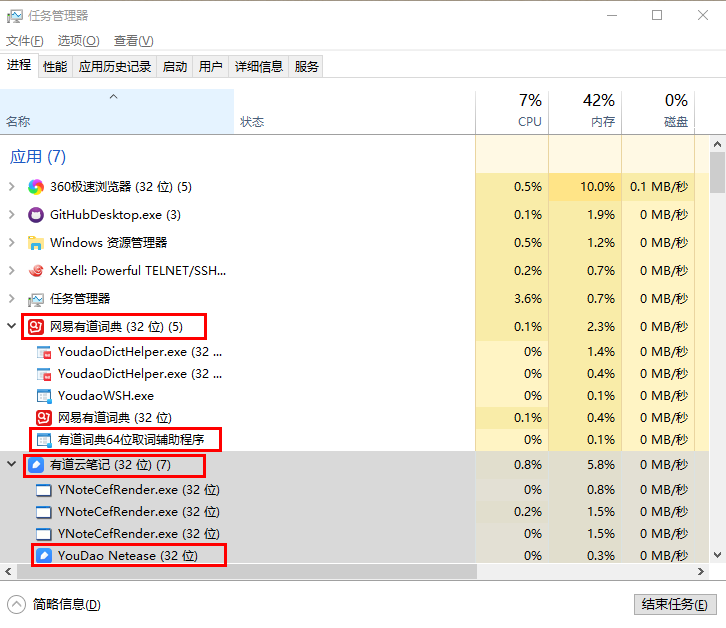
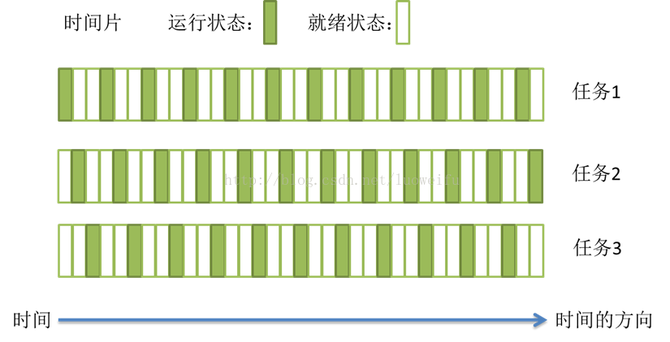
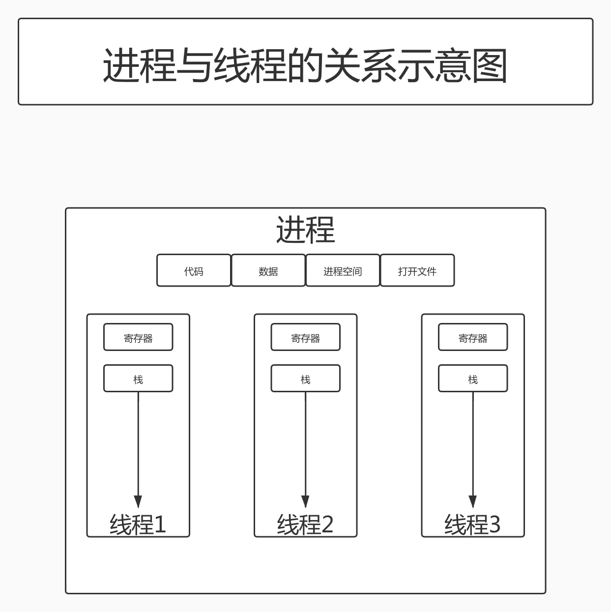
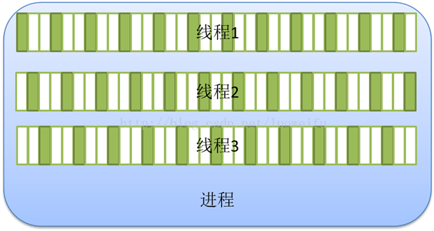
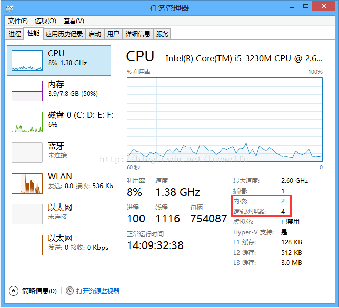
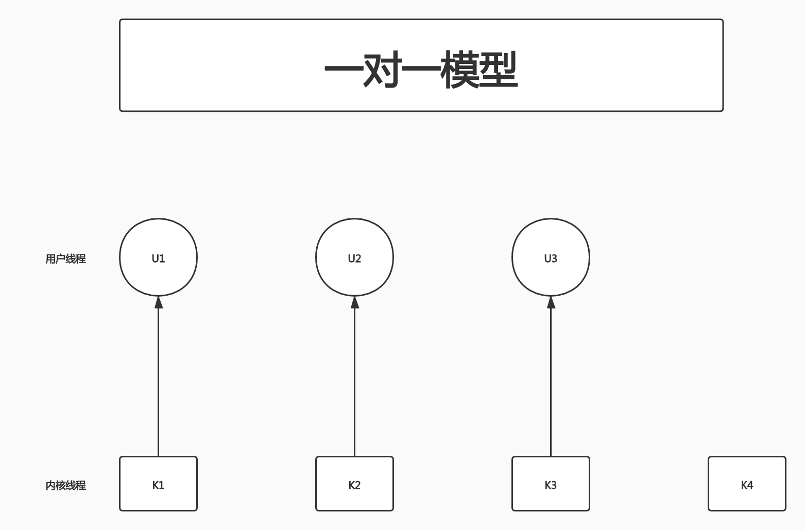
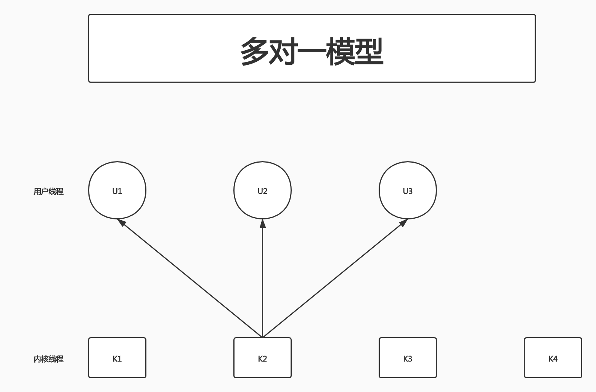
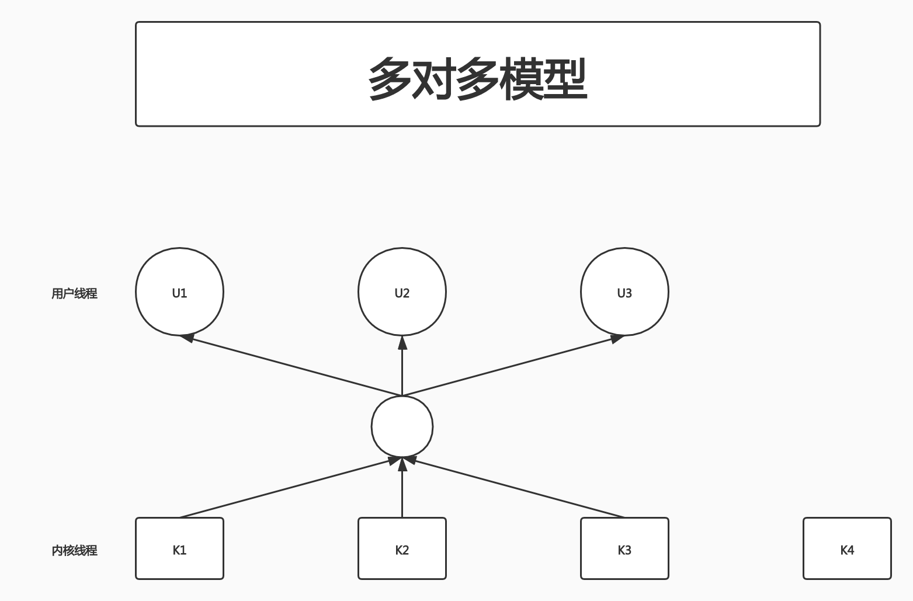
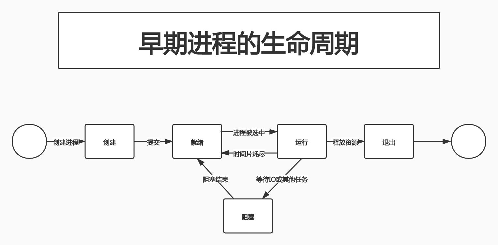
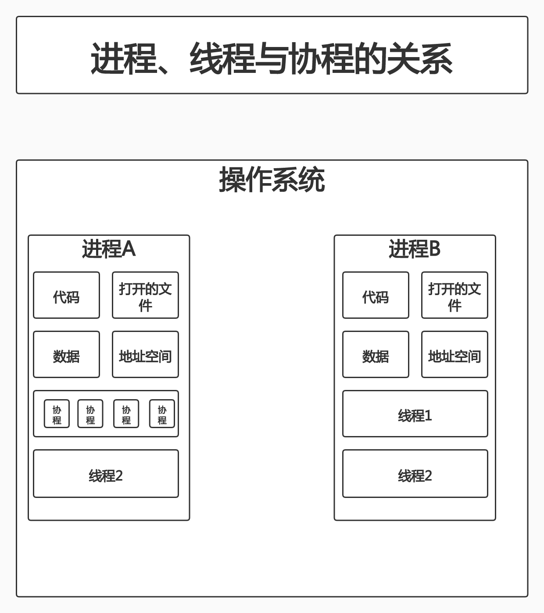

# 进程、线程、协程

## 进程

我们都知道计算机的核心是CPU,它承担了所有的计算任务.而OS是计算机的管理者,它负责任务的调度、资源的分配和管理,同龄整个计算机的硬件.应用程序则是具有某种功能的程序,程序运行于OS之上.

**进程:是一个具有一定独立功能的程序,在一个数据集上一次动态执行的过程,是操作系统进行资源分配和调度的一个独立单位,是应用程序运行的载体**.进程是一种抽象的概念,从来就没有统一的标准定义.

注:[进程](https://zh.wikipedia.org/wiki/%E8%A1%8C%E7%A8%8B)

**进程一般由程序、数据集合和进程控制块三部分组成**.

- 程序用于描述进程要完成的功能,是控制进程执行的指令集
- 数据集合是程序在执行时所需要的数据和工作区
- 程序控制块(Program Control Block,简称PCB),包含进程的描述信息和控制信息,是进程存在的唯一标志.

进程的特征:

- 动态性:进程时程序的一次执行过程,是临时的,有生命周期的,是动态产生,动态消亡的
- 并发性:任何进程都可以同其他进程一起并发执行
- 独立性:进程是系统进行资源分配和调度的一个独立单位
- 结构性:进程由程序、数据和进程控制块3部分组成

## 线程

在早期的OS中,并没有线程这个概念.进程是能拥有资源和独立运行的最小单位,也是程序执行的最小单位.任务调度采用的是**时间片轮转的抢占式调度方式**,而进程是任务调度的最小单位,每个进程有各自独立的一块内存,使得各个进程之间内存地址相互隔离.

后来,随着计算机的发展,对CPU的要求越来越高,进程之间的切换开销较大,已经无法满足越来越复杂的程序的要求了.于是就有了线程.

**线程:程序执行中一个单一的顺序控制流程,是程序执行流的最小单元,是处理器调度和分派的基本单位**.一个进程可以有一个或多个线程,各个线程之间共享程序的内存空间(即线程所在的进程的内存空间).**一个标准的线程由线程ID、当前指令指针(PC)、寄存器和堆栈组成**.而进程由内存空间(代码、数据、进城空间、打开的文件)和1个或多个线程组成.

如图,进程下有多个执行不同任务的线程

### 任务调度

要理解线程,就需要先了解OS的调度方式.大部分OS的任务调度采用**时间片轮转的抢占式调度方式**.

在1个进程中,当1个线程任务执行几毫秒后,会由OS的内核(负责管理各个任务)(前文已经说过,线程是处理器调度和分派的基本单位)进行调度,通过硬件的计数器中断处理器,让该线程强制暂停并将该线程的寄存器放入内存中,通过查看线程列表决定接下来执行哪一个线程,并从内存中恢复该线程的寄存器,最后恢复该线程的执行,以便达到执行下一个任务的目的.

上述过程中:

- **任务执行的那一小段时间叫做时间片**
- **任务正在执行的状态叫运行状态**
- **被暂停的线程任务状态叫就绪状态**.意为等待下一个属于它的时间片的到来.

这种方式保证了每个线程轮流执行,由于CPU的执行效率非常高,时间片非常短,在各个任务之间快速地切换,给人的感觉就是多个任务在"同时进行",也就是并发.并发的概念简单理解就是:**多个任务同时执行**.

### 进程与线程的区别

1. 线程是程序执行的最小单位,而进程是OS分配资源的最小单位
2. 1个进程由1个或多个线程组成,线程是1个进程中代码的不同知性路线
3. 进程之间相互独立,但同一进程下的各个线程之间通项程序的内存空间(包括代码段、数据集、堆等)和一些进程级的资源(如打开文件和信号),某进程内的线程对其它进程不可见
4. 调度和切换:线程上下文切换比进程上下文切换要快得多

线程和进程都是一种抽象的概念,线程是一种比进程更小的抽象,线程和进程都可以用于实现并发.在早期的OS中并没有线程的概念,进程是能拥有资源和独立运行的最小单位,也是程序执行的最小单位.它相当于1个进程中只有1个线程,进程本身即是线程.所以线程有时也被称为轻量级进程(Lightweight Process,LWP).

后来,随着计算机的发展,对多个任务之间上下文切换的效率要求越来越高,就抽象出一个更小的概念:线程.一般1个进程会有多个(也可能是1个)线程.

### 多线程与多核

上面提到的时间片轮转的调度方式说一个任务执行一小段时间后,强制暂停,去执行下一个任务,每个任务轮流执行.很多OS的书都说"同一时刻只有一个任务在执行".那么如果是双核的CPU呢?难道2个核不是同时运行吗?

其实"同一时刻只有一个任务在执行"这句话是不准确的,至少它是不全面的.那多核处理器的情况下,线程是怎样执行呢?这就需要了解内核线程.

多核处理器:在1个处理器上集成多个运算核心从而提高计算能力,也就是有多个并行计算的处理核心,**每一个处理核心对应一个内核线程**.

**内核线程(Kernel Thread, KLT):直接由操作系统内核支持的线程,这种线程由内核来完成线程切换,内核通过操作调度器对线程进行调度,并负责将线程的任务映射到各个处理器上**.一般1个处理核心对应1个KLT,比如单核处理器对应一个内核线程,双核处理器对应两个内核线程,四核处理器对应四个内核线程.

现在的电脑一般是双核四线程、四核八线程,是采用超线程技术将一个物理处理核心模拟成两个逻辑处理核心,对应两个内核线程,所以在操作系统中看到的CPU数量是实际物理CPU数量的两倍,如你的电脑是双核四线程,打开"任务管理器->性能"可以看到4个CPU的监视器4四核八线程可以看到8个CPU的监视器.

超线程技术就是利用特殊的硬件指令,把1个物理芯片模拟成2个逻辑处理核心,**让单个处理器能够做线程级并行计算**,进而兼容多线程OS和软件,减少CPU的闲置时间,提升CPU的运行效率.这种超线程技术(如双核四线程)由处理器硬件的决定,同时也需要操作系统的支持才能在计算机中表现出来.

**程序一般不会去使用内核线程,而是去使用内核线程的一种高级接口:轻量级进程(Lightweight Process,LWP)**,轻量级进程就是我们通常意义上所讲的线程,也被叫做用户线程.由于每个轻量级进程都由一个内核线程支持,因此只有先支持内核线程,才能有轻量级进程.用户线程与内核线程的对应关系有3种模型:

- 一对一模型
- 多对一模型
- 多对多模型

以下我们以4个内核线程,3个用户线程为例,进行说明.

### 一对一模型

**一对一模型:1个用户线程唯一对应1个内核线程(反过来不一定成立,1个内核线程不一定有对应的用户线程)**.这样,如果CPU没有采用超线程技术(比如一台4核4线程的计算机),1个用户线程就唯一映射到1个物理CPU的内核线程,**线程之间的并发是真正的并发**.一对一模型使用户线程具有和内核线程一样的优点,1个线程因某种原因阻塞时,其他线程的执行不受影响;且一对一模型可以让多线程程序在多处理器系统上有更好的表现.

但一对一模型有2个缺点:

1. 许多OS限制了内核线程的数量,因此一对一模型会使用户线程的数量受到限制
2. 许多OS内核线程调度时,上下文切换开销较大,导致用户线程的执行效率下降

### 多对一模型

**多对一模型:将多个用户线程映射到一个内核线程上,线程之间的切换由用户态的代码来进行,系统内核感受不到线程的实现方式**.用户线程的建立、同步、销毁等都在用户态完成,不需要内核的介入.因此相对一对一模型,多对一模型的线程上下文切换速度要快许多;此外,多对一模型对用户线程的数量几乎没有限制.

但多对一模型也有2个缺点:

1. 如果其中一个用户线程阻塞,那么其他所有线程都将无法执行,因为此时内核线程也随之阻塞了;
2. 在多处理器系统上,处理器数量的增加对多对一模型的线程性能不会有明显的增加,因为所有的用户线程都映射到1个处理器上了

### 多对多模型

**多对多模型:结合了一对一模型和多对一模型的优点,将多个用户线程映射到多个内核线程上.由线程库负责在可用的可调度实体上调度用户线程,这使得线程的上下文切换非常快,因为它避免了系统调用.**但是增加了复杂性和优先级倒置的可能性,以及在用户态调度程序和内核态调度程序之间没有广泛(且高昂)协调的次优调度.

多对多模型的优点:

1. 1个用户线程的阻塞不会导致所有线程的阻塞,因为此时还有别的内核线程被调度来执行
2. 多对多模型对用户线程的数量没有限制
3. 在多处理器的OS中,多对多模型的线程也能得到一定的性能提升,但提升的幅度不如一对一模型高

在现在主流的OS中,大多都是采用多对多模型

### 线程的生命周期

当线程的数量小于处理器的数量时,线程的并发是真正的并发,不同的线程运行在不同的处理器上.但当线程的数量大于处理器的数量时,线程的并发并不是真正的并发,因为此时至少有1个处理器要运行多个线程.

在单个处理器运行多个线程时,并发是一种模拟出来的状态.OS采用时间片轮转的方式,轮流执行每一个线程.现在,几乎所有的现代操作系统采用的都是时间片轮转的抢占式调度方式,如我们熟悉的Unix、Linux、Windows及macOS等流行的操作系统.

上文已经说过,线程是程序执行的最小单位,也是任务执行的最小单位.在早期只有进程的OS中,进程有5种状态:

- 创建
	- 进程正在创建,还不能运行.OS在创建进程时要进行的工作包括分配和建立进程控制块表项、建立资源表格并分配资源、加载程序并建立地址空间
- 就绪
	- 时间片已用完,此进程被强制暂停,等待下一个属于它的时间片到来
- 运行
	- 此进程正在执行,正在占用时间片
- 阻塞(等待)
	- 也叫等待状态.等待某一事件(如IO或另一个线程)执行完
- 退出(结束)
	- 也叫结束状态.进程已结束,释放OS分配的资源

进程在运行中有3种状态:就绪、运行和阻塞.

早期的进程相当于现在只有单个线程的进程,那么现在的多线程的生命周期与早期进程的生命周期类似.

- 创建
	- 一个新的线程被创建,等待该线程被调用执行
- 就绪
	- 时间片已用完,此线程被强制暂停,等待下一个属于它的时间片到来
- 运行
	- 此线程正在执行,正在占用时间片
- 阻塞(等待)
	- 也叫等待状态.等待某一事件(如IO或另一个线程)执行完
- 退出(结束)
	- 也叫结束状态.进程已结束,释放OS分配的资源

## 协程

**协程**:英文Coroutines,是一种基于线程之上,但又比线程更加轻量级的存在,这种由程序员自己写程序来管理的轻量级线程叫做**用户空间线程**,**对内核来说具有不可见性**.

**因为是自主开辟的异步任务,所以很多人也更喜欢叫它们纤程(Fiber),或者绿色线程(Green Thread).如同一个进程可以拥有多个线程一样,一个线程也可以拥有多个协程**.

### 协程的目的

当出现长时间的I/O操作时,通过让出目前的协程调度以便执行下一个任务的的方式,来消除ContextSwitch上的开销.

### 协程的特点

1. 线程的切换由OS负责调度,而协程的切换由用户自己进行调度,减少了上下文切换,提高了效率
2. 线程的默认Stack大小是1M,而协程更轻量,接近1K.因此可以在同样大小的内存中开启更多的协程
3. 由于在同一个线程上,因此可以避免竞争关系而使用锁
4. 适用于被阻塞的,且需要大量并发的场景.但不适用于大量计算的多线程.遇到这种情况,最好用线程去解决

### 协程的原理

当出现IO阻塞时,由协程的调度器进行调度,通过将数据流立刻yield掉(可以理解为将数据流让出),并记录当前栈上的数据,阻塞完后立刻再通过线程恢复栈,并把阻塞的结果放到这个线程上去跑,这样看上去好像跟写同步代码没有任何差别.这个过程称为`coroutine`,而跑在由`coroutine`负责调度的线程称为`Fiber`.比如GO的`go`关键字,其实就是负责开启一个`Fiber`,让`func`跑在这个`Fiber`上.

由于协程的暂停完全由程序控制,发生在用户态上;而线程的阻塞状态由OS内核来进行切换,发生在内核态上.因此,协程的开销远远小于线程的开销,也就没有了ContextSwitch上的开销.

### 协程和线程的比较

|比较项|线程|协程|
|:-:|:-:|:-:|
|占用资源|初始单位1MB,固定不可变|初始一般为2KB,可随需要而增大|
|调度所属|由OS的内核完成|由用户完成|
|切换开销|涉及到模式切换(从用户态切换到内核态)、16个寄存器、PC、SP..等寄存器的刷新等|只有3个寄存器的值修改:PC、SP、DX|
|性能问题|资源占用太高,频繁创建销毁会带来严重的性能问题|资源占用小,不会带来严重的性能问题|
|数据同步|需要用锁等机制确保数据的一致性和可见性|不需要多线程的锁机制,因为只有1个线程,也不存在同时写变量冲突,在协程中控制共享资源不加锁,只需判断状态.因此执行效率比多线程高很多|

