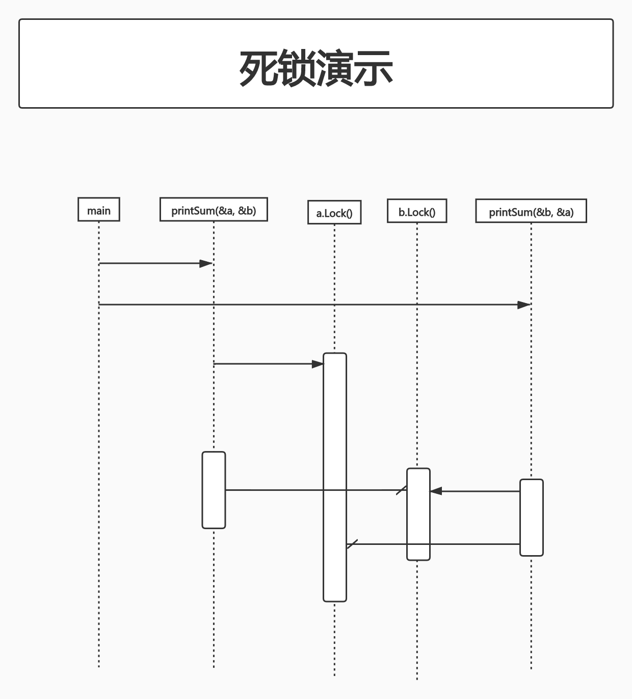

# Concurrency In Go

## 第1章 并发概述

### 摩尔定律,Web Scale和我们所陷入的混乱

Amdahl定律描述了一种方法,使用并行方式可以解决的问题,可以使用这种方法对其潜在的性能收益进行建模.简而言之,它指出,**收益的限制取决于有多少程序必须以顺序的方式编写.**

在某些情况下,可以通过将更多的核心提供给你的程序来取得显著的收益,之后困扰你的问题将变成**如何组合和存储结果.**

对于"令人尴尬的并行问题",建议在编写程序时,使其可以**水平缩放**.这意味着你可以独立执行程序的实例,在多个CPU或计算机上运行它,这将使系统运行时得到改善.

如果软件是Web Scale的,几乎就可以确定,这一定是"令人尴尬的并行问题".即Web Scale软件通常可以通过添加更多应用程序实例来处理更多吧并发的工作负载.

### 为什么并发很难?

在某些时间点(更高的磁盘利用率、更多的用户登录到系统等)到达之前,bug在代码中存在数年,以至于以前未被发现的bug在后面显露出来.

### 竞争条件

**当两个或多个操作必须按正确的顺序执行,而程序并未保证这个顺序时,就会发生竞争条件.**

**大多数情况下,这将在所谓的数据中出现,其中一个并发操作尝试读取一个变量,而在某个不确定的时间,另一个并发操作试图写入同一个变量.**

基本示例:

```go
package main

import "fmt"

func main() {
	var data int

	go func() {
		data++
	}()

	if data == 0 {
		fmt.Printf("the value is %d.\n", data)
	}
}
```

这段代码中,第9行和第12行都试图访问变量`data`.但无法保证它们的访问顺序,因此运行这段代码最终可能会得到3种结果:

1. 不打印任何东西
	- 这种情况下是第9行先于第12行执行
2. 打印"the value is 0."
	- 这种情况下是第12行和第13行先于第9行执行
3. 打印"the value is 1."
	- 这种情况下是第12行先于第9行执行,但第9行先于第13行执行

可以看到,虽然只有几行不正确的代码,但在程序中引入了巨大的不确定性.(注:本机运行只出现了"the value is 0."的结果)

在大多数情况下,引入数据竞争的原因是因为**开发人员在用顺序性的思维来思考问题**.他们假设,某一行代码逻辑会在另一行代码逻辑之前先运行.他们认为上述goroutine将在`if`语句读取数据变量之前,被安排执行.

有时候想象在2个操作之间会间隔很长一段时间是很有帮助的.假设调用goroutine的时间和它运行的时间相差1h.那程序的其他部分将会如何运行呢?(即关键字`go`后边的函数运行了1h,那么这段程序的结果将是打印"the value is 0.")如果在goroutine执行成功和程序执行到`if`语句之间也花费了一小时,又会发生什么呢?(可以认为在第11行加了一句`time.Sleep(1 * time.Hour)`,则这段程序的结果将是不打印任何东西)

**以这种方式思考很有帮助,因为对于计算机来说,规模可能不同,但相对的时间差异或多或少是相同的.**

有些开发人员在代码中使用了如下休眠语句,这看起来似乎解决了问题:

```go
package main

import (
	"fmt"
	"time"
)

func main() {
	var data int

	go func() {
		data++
	}()

	time.Sleep(1 * time.Second)

	if data == 0 {
		fmt.Printf("the value is %d.\n", data)
	}
}
```

注:此时本机运行结果为不打印任何东西.

数据竞争问题其实并没有被解决,之前的3个结果,在加入了`time.Sleep(1 * time.Second)`之后,其实还是有可能出现的.**我们在调用goroutine和检查数据值之间,休眠的时间越长,程序就越接近正确,但那只是概率上接近逻辑的正确性;它永远不会变成逻辑上的正确.**(注:比如真的有一台老旧的计算机,运行goroutine的时长需要1s,那么上述的3个结果将又会在这台计算机上出现,而非只出现"不打印任何东西"这一个结果)

结论:**始终以逻辑正确性为目标.在代码中引入休眠可以方便地调试并发程序,但并不能把它作为一个解决方案.**

**竞争条件是最难被发现的并发bug类型之一,因为它们可能在代码投入生产多年后才出现.**

## 原子性

**当某些东西被认为是原子的,或者具有原子性的时候,这意味着在它运行的环境中,它是不可分割的,或不可中断的.**

**上下文(context)**:可能在某个上下文中有些东西是原子性的,而在另一个上下文中却不是.也就是说,操作的原子性可以根据当前定义的范围而改变.

例如:在你的进程上下文中进行原子操作,在操作系统的上下文中可能就不是原子操作;在操作系统环境中进行原子操作,在机器环境上下文中可能就不是原子的;在你的机器上下文中进行原子操作,在你的应用程序的上下文中可能不是原子的.

**在考虑原子性时,经常第一件需要做的事,就是定义上下文或范围,然后再考虑这些操作是否是原子性的.一切都应当遵循这个原则.**

**术语不可分割(indivisible)和不可中断(uninterruptible)意味着在你所定义的上下文中,原子的东西将被完整的运行,而在这种情况下,不会同时发生任何事情**.

例:现有一行代码`i++`.看起来这个操作很原子,但简单分析就会发现其中有以下步骤:

- 检索`i`的值
- 增加`i`的值
- 存储`i`的值

这3个操作均为原子操作,但将这3个操作结合起来就可能不是,这取决于你的上下文.这揭示了原子操作的一个性质:**将多个原子操作结合不一定会产生一个更大的原子操作**.使一个操作变为原子操作取决于你想让这个操作在哪个上下文中.

就这个例子而言,如果你的上下文是一个没有并发进程的程序,那么`i++`在这个上下文中就是原子的;如果你的上下文是一个goroutine,且该goroutine不会将`i`暴露给其他goroutine,那么`i++`就是原子的.

**如果某个东西是原子的,隐含的意思是它在并发环境中是安全的.**

## 内存访问同步

现有一个数据竞争如下:2个并发进程试图访问相同的内存区域,它们访问内存的方式不是原子的.

例如:

```go
package main

import "fmt"

func main() {
	var data int

	go func() {
		data++
	}()

	if data == 0 {
		fmt.Printf("the value is 0.\n")
	} else {
		fmt.Printf("the value is %v.\n", data)
	}
}
```

**临界区**:程序中需要独占访问共享资源的部分.

那么在这段程序中,就有3个临界区:

1. `goroutine`需要独占访问`data`,做自增操作
2. `if`语句,需要独占访问`data`,以便能够检查`data`的值是否为0
3. `fmt.Printf()`语句,检索并打印变量的值

我们想要在临界区内使数据具有原子性(TODO:这句话的正确性存疑),可以采用的一个办法是**在临界区之间内存访问做同步**.

以下代码不是GO语言中惯用的方法,但它很简单地演示了内存访问同步.

```go
package main

import (
	"fmt"
	"sync"
)

func main() {
	var memoryAccess sync.Mutex

	var data int

	go func() {
		memoryAccess.Lock()
		data++
		memoryAccess.Unlock()
	}()

	memoryAccess.Lock()
	if data == 0 {
		fmt.Printf("the value is %v\n", data)
	} else {
		fmt.Printf("the value is %v\n", data)
	}
	memoryAccess.Unlock()
}
```

第9行:`var memoryAccess sync.Mutex`.允许代码对内存数据的访问做同步

第14行:`memoryAccess.Lock()`.声明一个锁.直到取消锁之前,goroutine应该独占该内存(即`data`)的访问权

第16行:`memoryAccess.Unlock()`.宣布goroutine使用完了这段内存

第19行:`memoryAccess.Lock()`.再次声明以下条件语句应该独占变量`data`内存的访问权

第25行:`memoryAccess.Unlock()`.宣布独占结束

内存访问同步:每个临界区对内存均有独占访问权(TODO:这个概念是我自己根据这段代码的理解 不一定对)

需要注意的是,虽然我们解决了数据竞争,但并没有解决**竞争条件!也就是说这个程序的操作顺序依旧是不确定的**.换句话说,goroutine和if...else块都有可能先执行.

**内存访问同步不会自动解决数据竞争或逻辑正确性问题.**

**以这种方式同步对内存的访问还有性能上的问题**.`Lock()`的调用会使我们的程序变慢.这带来了2个问题:

- 我的临界区是否是频繁进入和退出?
- 我的临界区应该有多大?

## 死锁、活锁和饥饿

### 死锁

**死锁**:所有并发进程彼此等待的程序.在这种情况下,如果没有外界的干预,这个程序将永远无法恢复.

例:

```go
package main

import (
	"fmt"
	"sync"
	"time"
)

type data struct {
	mu sync.Mutex
	value int
}

func main() {
	var wg sync.WaitGroup

	printSum := func(d1, d2 *data) {
		defer wg.Done()

		d1.mu.Lock()
		defer d1.mu.Unlock()

		time.Sleep(2 * time.Second)

		d2.mu.Lock()
		defer d2.mu.Unlock()

		fmt.Printf("sum=%v\n", d1.value + d2.value)
	}

	var a, b data
	wg.Add(2)
	go printSum(&a, &b)
	go printSum(&b, &a)
	wg.Wait()
}
```

第20行:`d1.mu.Lock()`.此处我们尝试进入临界区来传入一个值.(TODO:我对这句话的理解是goroutine需要独占访问`v1`)

第21行:`defer d1.mu.Unlock()`.此处我们使用`defer`语句在`printSum`返回之前退出临界区

第23行:`time.Sleep(2 * time.Second)`.此处休眠一段时间,来模拟一些工作.实际上是为了触发死锁



这个例子中,死锁的原因在于:第1次调用`printSum()`时,锁定了`a`,然后试图锁定`b`.但在此期间(即第23行休眠的2秒中里),第2次调用`printSum()`时,已经锁定了`b`并试图锁定`a`.这2个goroutine都无限地等待着.

死锁的几个必要条件,又被称为Coffman条件:

- 相互排斥
	- 并发进程同时拥有对资源的独占权

- 等待条件
	- 并发进程必须同时拥有一个资源,并等待额外的资源

- 没有抢占
	- 并发进程拥有的资源只能被该进程释放

- 循环等待
	- 一个并发进程P1必须等待一系列其他并发进程P2,这些并发进程P2同时也在等待进程P1

来看我们刚刚的例子,是否满足这4个条件:

1. `printSum()`函数确实需要`a`和`b`的独占权,满足**相互排斥**
2. 因为`printSum()`持有`a`或`b`并正在等待另一个,满足**等待条件**
3. 我们没有任何办法让我们的goroutine被抢占,满足**没有抢占**(TODO:被抢占是什么意思?)
4. 第1次调用的`printSum`,正在等待被第2次调用,反之亦然(TODO:第1次调用的`printSum()`等待第2次调用的`printSum()`释放`b`.反之,第2次调用的`printSum()`等待第1次调用的`printSum()`释放`a`)

**所有的Coffman条件中,至少有1个不成立,才能防止发生死锁.**

### 活锁

**活锁**:正在主动执行并发操作的程序,但是这些操作无法向前推进程序的状态.

比如2个人在走廊上相向而行.走廊很窄,互相都想给对方让路.A向左B向右,则两人依旧无法错开身位.

例:

```go
package main

import (
	"bytes"
	"fmt"
	"sync"
	"sync/atomic"
	"time"
)

func main() {
	cadence := sync.NewCond(&sync.Mutex{})

	go func() {
		for range time.Tick(1 * time.Millisecond) {
			cadence.Broadcast()
		}
	}()

	takeStep := func() {
		cadence.L.Lock()
		cadence.Wait()
		cadence.L.Unlock()
	}

	tryDir := func(dirName string, dir *int32, out *bytes.Buffer) bool {
		fmt.Fprintf(out, " %v", dirName)

		atomic.AddInt32(dir, 1)
		takeStep()
		if atomic.LoadInt32(dir) == 1 {
			fmt.Fprint(out, ". Success!")
			return true
		}

		takeStep()
		atomic.AddInt32(dir, -1)
		return false
	}

	var left, right int32
	tryLeft := func(out *bytes.Buffer) bool {return tryDir("left", &left, out)}
	tryRight := func(out *bytes.Buffer) bool {return tryDir("right", &right, out)}

	walk := func(walking *sync.WaitGroup, name string) {
		var out bytes.Buffer

		defer func() {fmt.Println(out.String())}()

		defer walking.Done()

		fmt.Fprintf(&out, "%v is trying to scoot:", name)

		for i := 0; i < 5; i++ {
			if tryLeft(&out) || tryRight(&out) {
				return
			}
		}

		fmt.Fprintf(&out, "\n%v tosses her hands up in exasperation!", name)
	}

	var peopleInHallway sync.WaitGroup
	peopleInHallway.Add(2)
	go walk(&peopleInHallway, "Alice")
	go walk(&peopleInHallway, "Barbara")
	peopleInHallway.Wait()
}
```

第26行:`tryDir`允许一个人尝试向一个方向移动,并返回是否成功.`dir`表示试图朝这个方向移动的人数

第29行:`atomic.AddInt32(dir, 1)`宣布将要向这个方向移动一个距离.此处只需知道这是一个原子操作即可

第30行:`takeStep()`.为了演示活锁,每个人都必须以相同的速度或节奏移动.`takeStep()`模拟了所有对象之间的一个不变的节奏

第37行:`atomic.AddInt32(dir, -1)`.这里的人意识到他们不能向这个方向走而放弃.我们通过把这个方向减1来表示

第54行:`for i := 0; i < 5; i++`.对尝试次数进行了人为限制,以便程序能够结束.在一个有活锁的程序中,可能没有这个限制,这就是问题所在!

第55行:`if tryLeft(&out) || tryRight(&out)`.首先,这个人试图向左走,如果失败了(即对方同时也在向左走),则这个人会尝试向右走

第63行:`var peopleInHallway sync.WaitGroup`.这个变量为程序提供了一个等待直到两人都能够相互通过或放弃(尝试5次后放弃)的方式

这个例子演示了使用活锁的一个十分常见的原因:**两个或两个以上的并发进程试图在没有协调的情况下防止死锁.**

**活锁要比死锁更复杂,因为它看起来程序好像在工作**.*但实际上你的程序会一直上演"hallway-shuffle"的循环游戏.

**活锁是一组被称为"饥饿"的更大问题的子集.**

### 饥饿


