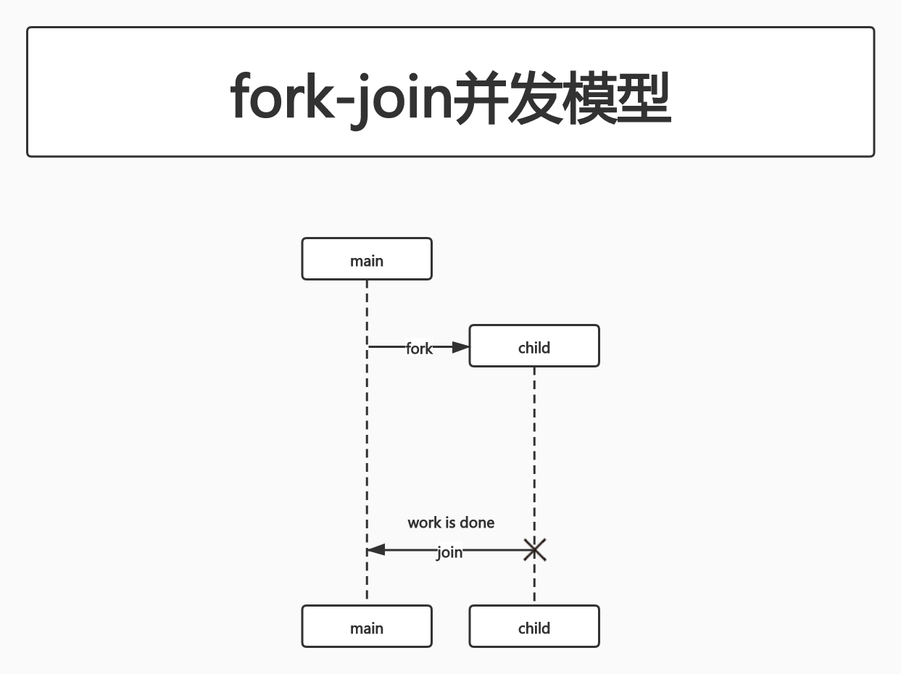

# Concurrency In Go

## 第3章 GO语言并发组件

### goroutine

goroutine是GO语言程序中最基本的组织单位之一.**事实上每个GO语言程序都至少有1个goroutine:main goroutine**.它在进程开始时自动创建并启动.

简单来讲,goroutine是一个并发的函数(记住:不一定是并行的),与其他代码一起运行.

****

个人理解:

并发是代码的属性,描述的是一个代码块具备和其他代码块在同一时刻被运行的能力;

并行是对运行时状态的描述,描述的是有2段代码在同一时刻被运行;

有并发能力的代码不一定能够被并行运行.比如这些代码被运行在了只有1个CPU核心的机器上.

****

```go
package main

import "fmt"

func main() {
	go sayHello()
	// 继续执行自己的逻辑
}

func sayHello() {
	fmt.Println("Hello")
}
```

既然goroutine是一个并发的函数,那么它也可以基于一个匿名函数被创建:

```go
package main

import "fmt"

func main() {
	go func() {
		fmt.Println("Hello")
	}()
	// 继续执行自己的逻辑
}
```

第8行:必须立刻在`go`关键字后面调用匿名函数来使用

也可以将函数分配给一个变量,并将这个函数命名为一个匿名函数:

```go
package main

import "fmt"

func main() {
	sayHello := func() {
		fmt.Println("Hello")
	}

	go sayHello()
	// 继续执行自己的逻辑
}
```

**这意味着我们可以用一个函数和一个关键字来创建一个并发的逻辑块**.

goroutine是如何工作的?

GO语言中,goroutine是独一无二的.goroutine不是OS线程,也不是绿色线程(由语言运行时管理的线程),**它们是一个更高级别的抽象,称为协程**.**协程是一种非抢占式的简单并发子程序(函数、闭包或方法),也就是说,协程不能被中断.但是协程有多个点,允许暂停或重新进入**.

goroutine没有定义自己的暂停或再运行点.GO的运行时会观察goroutine的运行时行为,并在它们阻塞时自动挂起它们,然后在它们不被阻塞时恢复它们.这使得它们具备了抢占的能力,但只是在goroutine被阻塞的地方具备这种能力.GO的运行时和goroutine的逻辑是一种优雅的合作关系.因此,goroutine可以被认为是一种特殊类型的协程.

协程可以被认为是goroutine的隐式并发结构,但并发并不是协程自身的属性.**某样东西必须能够同时托管几个协程,并且给每个协程一个执行的机会,才能够并发**.当然,有可能的情况是:有几个协程正在按顺序执行,但给了人一种并行执行的假象.实际上在GO中,这样的情况比较常见.

**GO语言的主机托管机制是一个名为M:N调度器的实现.它将M个绿色线程映射到N个OS线程.然后将goroutine安排在绿色线程上**.当我们的goroutine数量超过可用的绿色线程时,调度程序将处理分布在可用线程上的goroutine,并确保当这些goroutine被阻塞时,其他的goroutine可以运行.

GO语言遵循一个称为fork-join的并发模型.**fork这个词指的是在程序中的任意一点,它可以将执行的子分支与其父节点同时运行.join这个词指的是在将来某个时候,这些并发执行的分支将会合并在一起.**



`go`关键字为GO程序实现了fork,fork的执行者是goroutine.再来看这个例子:

```go
package main

import "fmt"

func main() {
	sayHello := func() {
		fmt.Println("Hello")
	}

	go sayHello()
	// 继续执行自己的逻辑
}
```

`sayHello`函数会在属于它的goroutine上运行,与此同时程序的其他部分也将继续执行.在这个例子中,没有join点.执行`sayHello`的goroutine将在未来的某个不确定的时间退出,而程序的其余部分将会继续执行.

但是,这个例子存在一个问题:**我们不确定`sayHello`函数是否会运行**.goroutine会被创建,并交由GO的运行时安排执行.**但是它实际上可能没机会在main goroutine退出之前运行**.

此处我们只是为了举例,所以main函数中没有其他逻辑.所以运行这段代码,几乎可以肯定的是:**程序将在goroutine被系统调用之前完成执行**.因此,你不会看到"Hello"被打印到stdout.你可以在创建goroutine之后执行`time.Sleep`.**但是,这实际上并没有创建一个join点,只有一个竞争条件(2个或多个操作需要按正确顺序执行,而程序并没有保证这个顺序,即为竞争条件)**.`time.Sleep`只是增加了`sayHello`在程序退出前goroutine被执行的概率,但你无法保证`sayHello`一定会被执行.**join点是保证程序正确性和消除竞争条件的关键**.

为了创建一个join点,你必须同步main goroutine和sayHello goroutine.这可以通过多种方式实现,此处使用`sync`包.此处关于如何创建连接点并不重要,但需要知道的是我们创建了一个连接点:

```go
package main

import (
	"fmt"
	"sync"
)

func main() {
	var wg sync.WaitGroup

	sayHello := func() {
		defer wg.Done()
		fmt.Println("Hello")
	}

	wg.Add(1)
	go sayHello()
	// 继续执行自己的逻辑
	wg.Wait()
}
```

第19行:`wg.Wait()`就是连接点的使用方式

这个例子中,阻塞了main goroutine,直到承载`sayHello`函数的goroutine终止.

通过这个例子我们大致了解了fork-join并发模型.现在让我们把注意力转移到闭包上.**闭包可以从创建它们的作用域中获取变量**.如果你在goroutine中运行一个闭包,那么闭包是在这些变量的副本上运行,还是原值上运行?

```go
package main

import (
	"fmt"
	"sync"
)

func main() {
	var wg sync.WaitGroup

	salutation := "Hello"

	wg.Add(1)

	go func() {
		defer wg.Done()
		salutation = "Welcome"
	}()

	wg.Wait()

	fmt.Println(salutation)
}
```

运行结果:

```
go run goroutineClosure.go 
Welcome
```

**事实证明,goroutine在它创建的相同地址空间内执行**.因此我们的程序打印"Welcome"

再来看一个例子,请问如下程序会打印什么?

```go
package main

import (
	"fmt"
	"sync"
)

func main() {
	var wg sync.WaitGroup

	for _, salutation := range []string{"Hello", "Greetings", "Good day"} {
		wg.Add(1)
		go func() {
			defer wg.Done()
			fmt.Println(salutation)
		}()
	}

	wg.Wait()
}
```

答案是:

```
go run goroutineClosure2.go 
Good day
Good day
Good day
```

这个例子中,跑在goroutine上的是一个闭包,这个闭包使用到了变量`salutation`.**而闭包使用到变量`salutation`时,对切片的迭代已经结束了.当循环迭代时,`salutation`被分配给切片中的下一个字符串值了.因为计划中goroutine可能在未来的任何时间点运行,所以不确定goroutine中会打印出什么值**.在我的机器上,当goroutine开始运行之前,很大概率循环迭代已经结束了.**这意味着变量`salutation`超出了范围**.

这引起了我们的疑问:goroutine可以引用超出范围的东西吗?goroutine会访问到已经被GC的内存吗?(TODO:[GO语言的堆栈管理](https://draveness.me/golang/docs/part3-runtime/ch07-memory/golang-stack-management/#fn:2))

这是一个关于如何管理内存的侧面说明.GO语言运行时会足够小心,对变量`salutation`的引用仍然保留,由内存转移到堆,以便goroutine可以继续访问它.

通常在我的机器上,在循环中的任何一个goroutine开始运行之前,循环就退出了.所以`salutation`会被转移到堆中,并保留对字符串切片中的最后一个值(即"Good day")的引用.因此会看到"Good day"被打印了3次.**想要让goroutine打印出字符串切片中的每一个元素,应该将`salutation`的副本传递到闭包中,这样当goroutine运行时,它就能够对来自循环迭代的数据进行操作**.

```go
package main

import (
	"fmt"
	"sync"
)

func main() {
	var wg sync.WaitGroup

	for _, salutation := range []string{"Hello", "Greetings", "Good day"} {
		wg.Add(1)

		go func(salutation string) {
			defer wg.Done()
			fmt.Println(salutation)
		}(salutation)
	}

	wg.Wait()
}
```

第14行:`go func(salutation string)`.声明一个参数,就像其他函数一样.把原来的`salutation`变量显式的映射到闭包中.

第17行:`(salutation)`.将当前迭代的变量传递给闭包.此处通过传参的方式,创建了一个字符串结构的副本,从而确保当goroutine运行时,可以引用正确的字符串.

运行结果:

```
go run goroutineClosure3.go 
Good day
Hello
Greetings
```

注:多运行几次,打印顺序可能不同.

因为这些goroutine在相同的地址空间中运行,并且只有简单的宿主函数,所有使用goroutine编写非并发代码是非常自然的(TODO:这句话是不是有误? 我认为是"所以使用goroutine编写并发代码是非常自然的").**GO的编译器很好地处理了内存中的变量,这样goroutine就不会意外地访问被释放的内存,这使得开发人员可以专注于他们的问题,而非内存管理**.

**由于多个goroutine可以在同一个地址空间上运行,所以我们仍然需要担心同步问题**.如同我们之前说的,我们可以选择同步访问goroutine访问的共享内存(个人理解:使用同步原语的意思),或者可以使用CSP原语通过通信来共享内存.

goroutine的另一个好处是它们非常轻.以下是官方FAQ的摘录:

一个新创建的goroutine有几千字节,这样的大小几乎总是够用的.如果不够用,GO语言运行时会自动增加(或缩小)存储堆栈的内存,从而允许很多goroutine存在于适量的内存中.CPU开销平均每个函数调用大约3个廉价指令.在同一个地址空间中,创建数十万个goroutine是可行的.如果goroutine只是执行等同于线程的任务,那么系统资源的消耗会更小.

**以下形式的goroutine不会被GC**:

```go
go func() {
	// 永远阻塞的操作
}()
// 其他逻辑
```

这个goroutine将一直存在,直到整个进程退出.

这个例子中,我们将goroutine不被GC的事实,与运行时的自省能力结合起来,并测算在goroutine创建之前和创建之后分配的内存数量:

```go
package main

import (
	"fmt"
	"runtime"
	"sync"
)

func main() {
	memConsumed := func() uint64 {
		runtime.GC()
		var s runtime.MemStats
		runtime.ReadMemStats(&s)
		return s.Sys
	}

	var c <- chan interface{}
	var wg sync.WaitGroup
	noop := func() {wg.Done(); <- c}
	const numGoroutines = 1e4
	wg.Add(numGoroutines)
	before := memConsumed()

	for i := numGoroutines; i > 0; i-- {
		go noop()
	}

	wg.Wait()
	after := memConsumed()
	fmt.Printf("%.3fkb\n", float64(after - before) / numGoroutines / 1000)
}
```

第19行:`noop := func() {wg.Done(); <- c}`.我们需要一个永远不会退出的goroutine,这样就可以在内存中保留一段时间用于测算.此处只需要了解这个goroutine不会退出即可(实际上是因为从只读管道中的读取操作阻塞了)

第20行:`const numGoroutines = 1e4`.定义了要创建的goroutine的数量.本例中我们用大数定律,逐渐接近1个goroutine的大小

第22行:`before := memConsumed()`.测算在创建goroutine之前消耗的内存总量

第29行:`after := memConsumed()`.测算在创建goroutine之后消耗的内存总量

运行结果:

```
go run goroutineSize.go
0.203kb
```

看起来FAQ说的是正确的.这个例子虽然有些理想化(因为我们创建的都是空的goroutine,什么都没有运行),但仍然可以让我们知道了可能创建的goroutine的数量.

存在一些可能会影响我们能够创建的goroutine规模的因素,比如上下文切换.**即:当一个被托管的并发进程必须保存它的状态,以便切换到另一个进程时**.如果有很多并发进程,那么上下文切换可能会消耗掉所有的CPU时间,那么这种场景下,就没有资源来完成真正需要CPU的工作(比如计算工作).在操作系统级别,使用线程代价高昂.操作系统线程必须保存寄存器值,查找表和内存映射之类的东西,才能在操作成功之后切换回当前线程.然后,它必须为传入的线程加载相同的信息.

而软件中的上下文切换相对来讲代价小得多.在一个软件定义的调度器下,运行时可以更具选择性地将数据持久化以便检索,比如运行时可以决定如何持久化,以及何时需要持久化.让我们来看看在操作系统线程之间上下文切换和goroutine之间上下文切换的相对性能:

操作系统线程上下文切换:

CPU信息:

```
cat /proc/cpuinfo 
processor	: 0
vendor_id	: GenuineIntel
cpu family	: 6
model		: 158
model name	: Intel(R) Core(TM) i5-9400F CPU @ 2.90GHz
stepping	: 10
microcode	: 0xb4
cpu MHz		: 2904.004
cache size	: 9216 KB
physical id	: 0
siblings	: 2
core id		: 0
cpu cores	: 2
apicid		: 0
initial apicid	: 0
fpu		: yes
fpu_exception	: yes
cpuid level	: 22
wp		: yes
flags		: fpu vme de pse tsc msr pae mce cx8 apic sep mtrr pge mca cmov pat pse36 clflush dts mmx fxsr sse sse2 ss ht syscall nx pdpe1gb rdtscp lm constant_tsc arch_perfmon pebs bts nopl xtopology tsc_reliable nonstop_tsc aperfmperf eagerfpu pni pclmulqdq ssse3 fma cx16 pcid sse4_1 sse4_2 x2apic movbe popcnt tsc_deadline_timer aes xsave avx f16c rdrand hypervisor lahf_lm abm 3dnowprefetch invpcid_single fsgsbase tsc_adjust bmi1 avx2 smep bmi2 invpcid rdseed adx smap xsaveopt xsavec xgetbv1 dtherm ida arat pln pts hwp hwp_notify hwp_act_window hwp_epp
bogomips	: 5808.00
clflush size	: 64
cache_alignment	: 64
address sizes	: 42 bits physical, 48 bits virtual
power management:

processor	: 1
vendor_id	: GenuineIntel
cpu family	: 6
model		: 158
model name	: Intel(R) Core(TM) i5-9400F CPU @ 2.90GHz
stepping	: 10
microcode	: 0xb4
cpu MHz		: 2904.004
cache size	: 9216 KB
physical id	: 0
siblings	: 2
core id		: 1
cpu cores	: 2
apicid		: 1
initial apicid	: 1
fpu		: yes
fpu_exception	: yes
cpuid level	: 22
wp		: yes
flags		: fpu vme de pse tsc msr pae mce cx8 apic sep mtrr pge mca cmov pat pse36 clflush dts mmx fxsr sse sse2 ss ht syscall nx pdpe1gb rdtscp lm constant_tsc arch_perfmon pebs bts nopl xtopology tsc_reliable nonstop_tsc aperfmperf eagerfpu pni pclmulqdq ssse3 fma cx16 pcid sse4_1 sse4_2 x2apic movbe popcnt tsc_deadline_timer aes xsave avx f16c rdrand hypervisor lahf_lm abm 3dnowprefetch invpcid_single fsgsbase tsc_adjust bmi1 avx2 smep bmi2 invpcid rdseed adx smap xsaveopt xsavec xgetbv1 dtherm ida arat pln pts hwp hwp_notify hwp_act_window hwp_epp
bogomips	: 5808.00
clflush size	: 64
cache_alignment	: 64
address sizes	: 42 bits physical, 48 bits virtual
power management:

processor	: 2
vendor_id	: GenuineIntel
cpu family	: 6
model		: 158
model name	: Intel(R) Core(TM) i5-9400F CPU @ 2.90GHz
stepping	: 10
microcode	: 0xb4
cpu MHz		: 2904.004
cache size	: 9216 KB
physical id	: 1
siblings	: 2
core id		: 0
cpu cores	: 2
apicid		: 2
initial apicid	: 2
fpu		: yes
fpu_exception	: yes
cpuid level	: 22
wp		: yes
flags		: fpu vme de pse tsc msr pae mce cx8 apic sep mtrr pge mca cmov pat pse36 clflush dts mmx fxsr sse sse2 ss ht syscall nx pdpe1gb rdtscp lm constant_tsc arch_perfmon pebs bts nopl xtopology tsc_reliable nonstop_tsc aperfmperf eagerfpu pni pclmulqdq ssse3 fma cx16 pcid sse4_1 sse4_2 x2apic movbe popcnt tsc_deadline_timer aes xsave avx f16c rdrand hypervisor lahf_lm abm 3dnowprefetch invpcid_single fsgsbase tsc_adjust bmi1 avx2 smep bmi2 invpcid rdseed adx smap xsaveopt xsavec xgetbv1 dtherm ida arat pln pts hwp hwp_notify hwp_act_window hwp_epp
bogomips	: 5808.00
clflush size	: 64
cache_alignment	: 64
address sizes	: 42 bits physical, 48 bits virtual
power management:

processor	: 3
vendor_id	: GenuineIntel
cpu family	: 6
model		: 158
model name	: Intel(R) Core(TM) i5-9400F CPU @ 2.90GHz
stepping	: 10
microcode	: 0xb4
cpu MHz		: 2904.004
cache size	: 9216 KB
physical id	: 1
siblings	: 2
core id		: 1
cpu cores	: 2
apicid		: 3
initial apicid	: 3
fpu		: yes
fpu_exception	: yes
cpuid level	: 22
wp		: yes
flags		: fpu vme de pse tsc msr pae mce cx8 apic sep mtrr pge mca cmov pat pse36 clflush dts mmx fxsr sse sse2 ss ht syscall nx pdpe1gb rdtscp lm constant_tsc arch_perfmon pebs bts nopl xtopology tsc_reliable nonstop_tsc aperfmperf eagerfpu pni pclmulqdq ssse3 fma cx16 pcid sse4_1 sse4_2 x2apic movbe popcnt tsc_deadline_timer aes xsave avx f16c rdrand hypervisor lahf_lm abm 3dnowprefetch invpcid_single fsgsbase tsc_adjust bmi1 avx2 smep bmi2 invpcid rdseed adx smap xsaveopt xsavec xgetbv1 dtherm ida arat pln pts hwp hwp_notify hwp_act_window hwp_epp
bogomips	: 5808.00
clflush size	: 64
cache_alignment	: 64
address sizes	: 42 bits physical, 48 bits virtual
power management:
```

使用Linux内置的基准测试套件来测量在同一个内核的2个线程之间,发送消息所需时间:

```
taskset -c 0 perf bench sched pipe -T
# Running 'sched/pipe' benchmark:
# Executed 1000000 pipe operations between two threads

     Total time: 3.491 [sec]

       3.491017 usecs/op
         286449 ops/sec
```

这个基准测量实际上度量了在一个线程上发送和接收消息所需的时间.因此我们将计算结果除以2,再均摊到1个线程上,可以得出:在这个CPU上,需要1.746μs来进行上下文切换.

再来看goroutine之间的上下文切换:

本例中我们使用GO来构建一个类似的基准测试.

CPU信息(本测试和上文Linux线程上下文测试的机器不是同一台机器):

```
machdep.cpu.brand_string: Intel(R) Core(TM) i7-7820HQ CPU @ 2.90GHz
machdep.cpu.core_count: 4
machdep.cpu.cores_per_package: 8
```

```go
package main

import (
	"sync"
	"testing"
)

func BenchmarkContextSwitch(b *testing.B) {
	var wg sync.WaitGroup
	begin := make(chan struct{})
	c := make(chan struct{})

	var token struct{}

	sender := func() {
		defer wg.Done()

		<- begin
		for i := 0; i < b.N; i++ {
			c <- token
		}
	}

	receiver := func() {
		defer wg.Done()

		<- begin
		for i := 0; i < b.N; i++ {
			<- c
		}
	}

	wg.Add(2)
	go sender()
	go receiver()
	b.StartTimer()
	close(begin)
	wg.Wait()
}
```

运行基准测试,只使用1个CPU,以便它对Linux基准测试是一个类似测试:

```
 go test -bench=. -cpu=1 contextSwitchCost_test.go
goos: darwin
goarch: amd64
BenchmarkContextSwitch   7320352               154 ns/op
PASS
ok      command-line-arguments  1.305s
```

可以看到,0.154μs.

可以很自然地说,上下文切换可能不会成为使用goroutine的障碍.