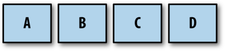
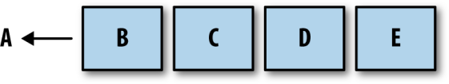

# Concurrency In Go

## 第3章 GO语言并发组件

### channel

#### 声明和初始化

channel,即管道(通道),衍生自Charles Antony Richard Hoare的CSP并发模型,是GO的并发原语,虽然它可以用于同步内存访问,但更好的用法是用于在goroutine之间传递消息.

可以把管道想象为一条河流,管道作为信息流的载体,数据沿着管道被传递,然后在下游被读出.因此,建议使用"Stream"作为`chan`类型的变量的后缀.在使用管道时,将一个值传递给`chan`类型的变量,然后在程序的其他位置再把这个值从管道中读取出来.**该值被传递的入口和出口不需要知道彼此的存在,只需使用管道的引用操作即可.**

可以使用`:=`来简化管道的创建,但程序中通常会先声明管道,然后创建它:

```go
package main

import "fmt"

func main() {
	var dataStream chan interface{}     // 声明一个channel.由于声明的类型为空接口,因此通常说它的类型是interface{}
	dataStream = make(chan interface{}) // 使用内置函数make()实例化channel
	fmt.Printf("%v\n", dataStream)
}
```

本例中定义了一个名为dataStream的管道,在该管道上可以写入或读取任意类型的值(因为其类型为空接口).

#### 单向管道

管道也可以声明为仅支持单向的数据流,即:你可以定义仅支持发送或接收数据的管道.

声明一个只读(只能从管道中读取)的单向管道:

```go
package main

import "fmt"

func main() {
	var dataStream <-chan interface{}
	dataStream = make(<-chan interface{})
	fmt.Printf("%#v\n", dataStream)
}
```

声明一个只写(只能向管道中发送)的单向管道:

```go
package main

import "fmt"

func main() {
	var dataStream chan<- interface{}
	dataStream = make(chan<- interface{})
	fmt.Printf("%#v\n", dataStream)
}
```

**通常不会经常看到实例化的单向管道,但会经常看到它们被用作函数参数和返回类型.这种做法非常有用.因为GO可以在需要时,将双向管道隐式转换为单向管道.**

例:

```go
package main

import "fmt"

func main() {
	var receiveChan <-chan interface{}
	var sendChan chan<- interface{}
	dataStream := make(chan interface{})
	
	receiveChan = dataStream // 隐式转换:将双向管道转换为只读管道
	sendChan = dataStream    // 隐式转换:将双向管道转换为只写管道

	fmt.Printf("%#v\n", receiveChan)
	fmt.Printf("%#v\n", sendChan)
}
```

将`<-`**操作符(注意<-是个操作符)**放到channel右边实现发送操作,通过将`<-`操作符放到channel的左侧实现接收操作.也可以认为:**数据流向箭头所指方向的变量.**

#### channel的阻塞

```go
package main

import "fmt"

func main() {
	stringStream := make(chan string)
	go func() {
		stringStream <- "Fuck World"
	}()
	fmt.Printf("receive from channel: %s\n", <-stringStream)
}
```

运行结果:

```
go run sendToChannelAndReceiveFromChannel.go 
receive from channel: Fuck World
```

在之前介绍goroutine中说过,仅仅定义goroutine是没有办法保证这个goroutine在main goroutine退出之前运行.但这个例子中main goroutine总能从channel中读取到数据,说明匿名函数的goroutine总是在在main goroutine退出之前运行.为什么?

因为channel是包含阻塞机制的.也就是说试图向一个已满的channel进行写入操作的任何goroutine都会阻塞,直到channel不再满载;试图从一个空channel中进行读取操作的任何goroutine也会阻塞,直到channel中至少被写入了1个值.

TODO:如果这段代码运行在一个只有1核CPU的机器上,会发生什么?

尝试将一个值写入只读管道,或者从只写管道中读取值,都是错误的:

```go
package main

func main() {
	writeStream := make(chan<- interface{})
	readStream := make(<-chan interface{})

	<-writeStream
	readStream <- "fuck"
}
```

```
go run writeToOnlyReadChannelAndReadFromOnlyWriteChannel.go 
writeToOnlyReadChannelAndReadFromOnlyWriteChannel.go:7:4: invalid operation: cannot receive from send-only channel writeStream (variable of type chan<- interface{})
writeToOnlyReadChannelAndReadFromOnlyWriteChannel.go:8:2: invalid operation: cannot send to receive-only channel readStream (variable of type <-chan interface{})
```

这是GO类型系统中的一部分.GO的类型系统允许我们在处理并发原语时也为我们保证类型安全(type-safety).**这有助于于构建易于推理的、可组合的逻辑程序.**

不正确地构造程序会导致死锁.以下示例中,引入了一个无意义的条件,该条件可以阻止goroutine向channel中写入:

```go
package main

import "fmt"

func main() {
	stringSteam := make(chan string)
	go func() {
		if 0 != 1 {
			return
		}
		stringSteam <- "Fuck"
	}()

	fmt.Println(<-stringSteam)
}
```

运行结果:

```
go run equivocalConditionResultInDeadlock.go 
fatal error: all goroutines are asleep - deadlock!

goroutine 1 [chan receive]:
main.main()
        /Users/xxx/Desktop/ConcurrencyInGo/code/chapter3/29-equivocalConditionResultInDeadlock/equivocalConditionResultInDeadlock.go:14 +0x7f
exit status 2
```

main goroutine正在等待一个值被写入到`stringStream`中,但是由于添加了条件`0 != 1`,导致写入操作永远不会发生.当匿名goroutine退出时,检测到所有goroutine都没有运行,就报告了死锁.

#### channel被关闭的标识

使用`<-`操作符从管道中读取数据时,可以选择返回2个值:

```go
package main

import "fmt"

func main() {
	stringStream := make(chan string)
	go func() {
		stringStream <- "Fuck"
	}()
	salutation, ok := <-stringStream
	fmt.Printf("(%v): %v\n", ok, salutation)
}
```

- 第11行:这行代码中的变量`ok`是读取操作时的一个标识.该标识用于表示从channel中读取的数据是由其他程序写入的,还是由于关闭管道产生的.若读取的数据是由其他程序写入的,则该值为true;若读取的数据由于管道关闭产生的,则该值为false.

这个标识非常有用.因为有了这个标识,下游的程序(即消费者)知道何时该消费、何时该退出、何时该在一个新的channel上重新开始通信等.

确实,我们不一定必须使用这个标识.也可以通过给每个channel定义一个特殊值的方式来达到同等的效果(比如上下游约定,对于一个`chan int`,若生产者向该channel中写入值`123456`,则表示上游将要关闭管道;若消费者从管道中读取到值`123456`,则消费者准备退出管道通信),但这样的特殊值将会充斥每一个channel.而channel只是一个简单的数据传输channel,而不是一个具有签名的函数,所以关闭channel是一个常见操作.这个内置的标识对于消费者来说,就像一个哨兵,它告知消费者:"上游不会写入更多数据了,请继续做管道通信之后的操作吧".

关闭管道并不会影响数据的读取,例子如下:

```go
package main

import "fmt"

func main() {
	intStream := make(chan int)
	close(intStream)
	integer, ok := <-intStream
	fmt.Printf("(%v): %v\n", ok, integer)
}
```

运行结果:

```
go run closeChannelButDoNotAffectRead.go 
(false): 0
```

- 第7行:使用`close`关键字关闭管道
- 第9行:关闭管道不影响读取操作

这段代码中值得注意的是,在关闭管道前,并没有将任何值写入到channel中.但依然能够从管道中读取到数据.而且,**尽管channel已经关闭,但仍然可以继续在这个channel上无限制地执行读取操作(第8行重复几遍仍然可以从管道中取到值)**.这样的设计是为了支持单个上游向channel中写入,而多个下游从channel中读取的场景.变量`ok`表明读取到的值是一个int的零值,而非是上游写入的值.

channel的for range操作:

```go
package main

import "fmt"

func main() {
	intStream := make(chan int)
	go func() {
		defer close(intStream)
		for i := 1; i <= 5; i++ {
			intStream <- i
		}
	}()

	for integer := range intStream {
		fmt.Printf("%d\n", integer)
	}
}
```

运行结果:

```
go run forRangeChannel.go
1
2
3
4
5
```

使用`for range`遍历一个channel时,当channel关闭,循环会自动结束.需要注意的是:该循环不需要退出条件,且range方法不返回表示channel是否被关闭的标识.这种遍历方式,隐藏了对channel关闭的处理,确保循环足够简洁.

**关闭channel也是一种同时给多个goroutine发送信号的方法**.假设有多个goroutine在同一个channel上阻塞,那么通过关闭管道的方式就可以让这些goroutine都解除阻塞,而不需要写一个循环来解除每个goroutine的阻塞.由于一个被关闭的channel可以被无限次的读取,所以无论在这个channel上阻塞的goroutine数量是多少,关闭channel都比循环执行N次解除阻塞的操作更合适,而且更快.

例:1次操作同时解除多个goroutine的阻塞

```go
package main

import (
	"fmt"
	"sync"
)

func main() {
	var wg sync.WaitGroup
	begin := make(chan interface{})
	for i := 0; i < 5; i++ {
		wg.Add(1)
		go func(i int) {
			defer wg.Done()
			<-begin
			fmt.Printf("%d has begin\n", i)
		}(i)
	}

	fmt.Printf("unblocking goroutines...\n")
	close(begin)
	wg.Wait()
}
```

运行结果:

```
go run closeChannelAsSignal.go
unblocking goroutines...
1 has begin
2 has begin
0 has begin
4 has begin
3 has begin
```

- 第15行:此处从begin中读取,由于没有任何值写入到channel中,所以此处会阻塞
- 第21行:关闭channel之后,所有goroutine的阻塞会被解除

当然这个例子也可以使用`sync.Cond`来实现.但channel是可组合的,这是`sync.Cond`不可比拟的优势.

****

题外话:使用`sync.Cond`达到同等效果:

Q:以下这段代码问题在哪儿?

```go
package main

import (
	"fmt"
	"sync"
)

func main() {
	var wg sync.WaitGroup
	c := sync.NewCond(&sync.Mutex{})
	for i := 0; i < 5; i++ {
		wg.Add(1)
		go func(i int) {
			defer wg.Done()
			c.L.Lock()
			c.Wait()
			fmt.Printf("%d has begin\n", i)
			c.L.Unlock()
		}(i)
	}

	fmt.Printf("unblocking goroutines...\n")
	c.Broadcast()
	wg.Wait()
}
```

可能出现的情况是:5个goroutine中的某几个尚未被阻塞(还没执行到`c.Wait()`),main goroutine已经执行`c.Broadcast()`了.那么这些goroutine将一直阻塞在`c.Wait()`这一行上,无法被唤醒,因此发生死锁.

当然,再底层的原因可能是因为`notifyListNotifyAll()`函数中将`notifyList`给清空了,因此再调用`c.Wait()`时会报一个0x0的错误.

也有可能是因为goroutine还没有被创建,就调用了`c.Broadcast()`.原因不明.

运行结果:

```
unblocking goroutines...
3 has begin
2 has begin
0 has begin
1 has begin
fatal error: all goroutines are asleep - deadlock!

goroutine 1 [semacquire]:
sync.runtime_Semacquire(0x10644f7?)
        /usr/local/go/src/runtime/sema.go:56 +0x25
sync.(*WaitGroup).Wait(0x10c33c8?)
        /usr/local/go/src/sync/waitgroup.go:136 +0x52
main.main()
        /Users/xxx/Desktop/ConcurrencyInGo/code/chapter3/33-closeChannelAsSignal/sameEffectByCond.go:24 +0x199

goroutine 22 [sync.Cond.Wait]:
sync.runtime_notifyListWait(0xc000130050, 0x4)
        /usr/local/go/src/runtime/sema.go:513 +0x13d
sync.(*Cond).Wait(0x0?)
        /usr/local/go/src/sync/cond.go:56 +0x8c
main.main.func1(0x0?)
        /Users/xxx/Desktop/ConcurrencyInGo/code/chapter3/33-closeChannelAsSignal/sameEffectByCond.go:16 +0x7b
created by main.main
        /Users/xxx/Desktop/ConcurrencyInGo/code/chapter3/33-closeChannelAsSignal/sameEffectByCond.go:13 +0x8a
exit status 2
```

改进有2种办法:

1. 使用channel让这5个被阻塞的goroutine传递信号给main goroutine
2. 使用计数器让这5个被阻塞的goroutine传递信号给main goroutine

其实本质是一样的,都是要传递一个goroutine已经被创建的信号给main goroutine.

使用channel传递信号:

```go
package main

import (
	"fmt"
	"sync"
)

func main() {
	var wg sync.WaitGroup
	c := sync.NewCond(&sync.Mutex{})
	signal := make(chan interface{})
	for i := 0; i < 5; i++ {
		wg.Add(1)
		go func(i int) {
			signal <- struct{}{}
			defer wg.Done()
			c.L.Lock()
			c.Wait()
			fmt.Printf("%d has begin\n", i)
			c.L.Unlock()
		}(i)
	}

	for i := 0; i < 5; i++ {
		<-signal
	}

	fmt.Printf("unblocking goroutines...\n")
	c.Broadcast()
	wg.Wait()
}
```

使用原子计数器传递信号:

```go
package main

import (
	"fmt"
	"sync"
	"sync/atomic"
)

func main() {
	var wg sync.WaitGroup
	c := sync.NewCond(&sync.Mutex{})
	var count int32
	for i := 0; i < 5; i++ {
		wg.Add(1)
		go func(i int) {
			defer wg.Done()
			atomic.AddInt32(&count, 1)
			c.L.Lock()
			c.Wait()
			c.L.Unlock()
			fmt.Printf("%d has begin\n", i)
		}(i)
	}

	for {
		if atomic.LoadInt32(&count) == int32(5) {
			break
		}
	}

	fmt.Printf("unblocking goroutines...\n")
	c.Broadcast()
	wg.Wait()
}
```

需要注意的是,此处使用的是原子操作来完成的+1,所以并不需要将`atomic.AddInt32(&count, 1)`这行放在`c.L.Lock()`和`c.L.Unlock()`之间.

****

#### 缓冲管道

接下来我们讨论缓冲管道.

缓冲管道:在实例化时提供可携带元素的容量的管道.

这也就表示,即使在没有对管道进行读取操作的前提条件下,goroutine依然可以执行N次写入操作,这里的N是指缓冲管道的容量.

实例化一个缓冲管道:

```go
var dataStream chan interface{}
dataStream = make(chan interface{}, 4)
```

此处特意将初始化缓冲管道的代码分为2行写.以便能够清楚的看到:**缓冲管道和非缓冲管道在声明上是没有区别的,是否具有缓冲是在实例化的时候决定的.**

而这种声明与实例化分开的方式,也意味着可以在实例化的位置(比如某个goroutine内)确定一个管道是否需要缓冲,这也说明管道的建立需要与goroutine紧密耦合.

无缓冲管道也可以被定义为缓冲管道,一个无缓冲管道只是一个以0容量创建的缓冲管道.以下代码等价:

```go
a := make(chan int)
b := make(chan int, 0)
```

这2个管道都是0容量的int channel.当我们讨论阻塞时,如果说channel是满的,那么写入channel阻塞;如果说channel是空的,那么从channel中读取阻塞.这里的"满"和"空"是针对缓冲区的大小而言的.无缓冲的管道容量为0,因此在任何写入操作之前管道就已经是满的了.一个容量为4的缓冲管道,在没有下游从该管道中读取的前提条件下,执行4次写入操作后会是满的,当第5次写入时会阻塞,因为它没有其他位置可以放置第5个元素,此时它的行为和无缓冲管道是一样的.**缓冲管道和无缓冲管道的区别在于:管道为空和管道为满的前提条件不同.无缓冲管道一直处于"满"的状态;而缓冲管道才有"空"和"满"的区别.**

**通过这种方式,缓冲管道可以在内存中构建一个用于并发进程通信的FIFO队列.**

为了帮助理解这一点,我们用例子来解释一个具有4个容量的缓冲channel的情况.

- step1. 初始化

```go
c := make(chan rune, 4)
```


- step2. 向通道写入

```go
c <- 'A'
```

当这个channel没有被下游读取时,`'A'`将被放置在管道缓冲区的第1个槽中,如下图示:


- step3. 后续写入到缓冲管道(假设没有下游读取)的值都会在缓冲channel中填充剩余的槽

```go
c <- 'B'
```


```go
c <- 'C'
```


```go
c <- 'D'
```



- step4. 经过4次写入后,此时缓冲管道已经装满了4个元素.再向管道中写入

```go
c <- 'E'
```


很明显执行写入操作的goroutine会被阻塞.而且该goroutine会一直保持阻塞状态,直到有其他goroutine执行读取操作,以便让缓冲区中能够空出位置来.

- step5. 下游读取

```go
<- c
```



如图所示,下游的读取操作会依次接收到位于管道中的数据,被阻塞的写入操作将会解除阻塞,`'E'`被放置在缓冲区的末尾.

**这句话存疑:若一个缓冲管道是空的,并且有一个下游在接收,那么缓冲区将直接被绕过,值将直接从发送方传递到接收方.**

缓冲管道在某些情况下很有用,但应该小心使用.**缓冲管道很容易成为一种不成熟的优化,并且在使用缓冲管道时,死锁会变得更隐蔽**.对于我们而言,宁愿在第一次编写代码时找到一个死锁,而不是在半夜系统崩溃了才发现.

一个缓冲管道的使用示例:

```go
package main

import (
	"bytes"
	"fmt"
	"os"
)

func main() {
	var stdoutBuffer bytes.Buffer
	defer stdoutBuffer.WriteTo(os.Stdout)

	intStream := make(chan int, 4)
	go func() {
		defer close(intStream)
		defer fmt.Fprintf(&stdoutBuffer, "Producer done.\n")
		for i := 0; i < 5; i++ {
			fmt.Fprintf(&stdoutBuffer, "Sending: %d\n", i)
			intStream <- i
		}
	}()

	for integer := range intStream {
		fmt.Fprintf(&stdoutBuffer, "Received: %d\n", integer)
	}
}
```

运行结果如下:

```
go run useBufferChannel.go
Sending: 0
Sending: 1
Sending: 2
Sending: 3
Sending: 4
Producer done.
Received: 0
Received: 1
Received: 2
Received: 3
Received: 4
```

- 第10行:`var stdoutBuffer bytes.Buffer`.创建一个内存缓冲区,以便减少输出的不确定性.内存缓冲区不会对输出内容做任何的保证,但比直接写到`os.Stdout`要快一点
- 第11行:`defer stdoutBuffer.WriteTo(os.Stdout)`.确保进程退出前讲缓冲区的内容写入标准输出
- 第13行:`intStream := make(chan int, 4)`.创建一个容量为4的管道

可以看到,匿名goroutine能够将5个结果都放在`intStream`中,并在main goroutine读取到每个结果之前就退出.

这是一个使用缓冲管道的正确优化示例:**如果负责写入管道的goroutine明确知道将会写入多少条数据,那么它就可以创建一个容量和写数量相同的缓冲管道,以便确保可以尽快的向管道中写入数据.**

****

但其实这段代码还有另外2种运行结果:

```
go run useBufferChannel.go
Sending: 0
Sending: 1
Sending: 2
Sending: 3
Sending: 4
Producer done.
```

```
go run useBufferChannel.go
Sending: 0
Sending: 1
Sending: 2
Sending: 3
Sending: 4
Received: 0
Received: 1
Received: 2
Received: 3
Received: 4
```

使用`-race`参数开启竟态检测:

```
go run -race useBufferChannel.go
==================
WARNING: DATA RACE
Write at 0x00c0001241a0 by main goroutine:
  bytes.(*Buffer).Write()
      /usr/local/go/src/bytes/buffer.go:169 +0x44
  fmt.Fprintf()
      /usr/local/go/src/fmt/print.go:205 +0xb1
  main.main()
      /Users/xxx/Desktop/ConcurrencyInGo/code/chapter3/34-useBufferChannel/useBufferChannel.go:24 +0x26d

Previous write at 0x00c0001241a0 by goroutine 7:
  bytes.(*Buffer).Write()
      /usr/local/go/src/bytes/buffer.go:169 +0x44
  fmt.Fprintf()
      /usr/local/go/src/fmt/print.go:205 +0xb1
  main.main.func1.2()
      /Users/xxx/Desktop/ConcurrencyInGo/code/chapter3/34-useBufferChannel/useBufferChannel.go:16 +0x5b
  runtime.deferreturn()
      /usr/local/go/src/runtime/panic.go:436 +0x32

Goroutine 7 (finished) created at:
  main.main()
      /Users/xxx/Desktop/ConcurrencyInGo/code/chapter3/34-useBufferChannel/useBufferChannel.go:14 +0x1ea
==================
==================
WARNING: DATA RACE
Read at 0x00c000124180 by main goroutine:
  bytes.(*Buffer).tryGrowByReslice()
      /usr/local/go/src/bytes/buffer.go:107 +0x52
  bytes.(*Buffer).Write()
      /usr/local/go/src/bytes/buffer.go:170 +0x18
  fmt.Fprintf()
      /usr/local/go/src/fmt/print.go:205 +0xb1
  main.main()
      /Users/xxx/Desktop/ConcurrencyInGo/code/chapter3/34-useBufferChannel/useBufferChannel.go:24 +0x26d

Previous write at 0x00c000124180 by goroutine 7:
  bytes.(*Buffer).grow()
      /usr/local/go/src/bytes/buffer.go:144 +0x2c4
  bytes.(*Buffer).Write()
      /usr/local/go/src/bytes/buffer.go:172 +0xcd
  fmt.Fprintf()
      /usr/local/go/src/fmt/print.go:205 +0xb1
  main.main.func1.2()
      /Users/xxx/Desktop/ConcurrencyInGo/code/chapter3/34-useBufferChannel/useBufferChannel.go:16 +0x5b
  runtime.deferreturn()
      /usr/local/go/src/runtime/panic.go:436 +0x32

Goroutine 7 (finished) created at:
  main.main()
      /Users/xxx/Desktop/ConcurrencyInGo/code/chapter3/34-useBufferChannel/useBufferChannel.go:14 +0x1ea
==================
Sending: 0
Sending: 1
Sending: 2
Sending: 3
Sending: 4
Producer done.
Received: 0
Received: 1
Received: 2
Received: 3
Received: 4
Found 2 data race(s)
exit status 66xxx
```

这个检测结果表示:在这段代码中发现了2个数据竞争警告.

第1个数据竞争警告显示了在main goroutine中存在一个写操作,它正在对`bytes.Buffer`对象进行写入操作;而同时goroutine 7(也就是第14行创建的协程)也在对这个`bytes.Buffer`对象进行写入操作.

第2个数据竞争警告也是同样的内容

警告的最后一行:发现了2个数据竞争,程序退出的状态码为66

可以通过给`bytes.Buffer`对象加锁的方式来解决这个数据竞争问题:

```go
package main

import (
	"bytes"
	"fmt"
	"os"
	"sync"
)

func main() {
	var stdoutBuffer bytes.Buffer
	var lock sync.Mutex
	defer stdoutBuffer.WriteTo(os.Stdout)

	intStream := make(chan int, 4)
	go func() {
		defer func() {
			lock.Lock()
			fmt.Fprintf(&stdoutBuffer, "Producer done.\n")
			lock.Unlock()
			close(intStream)
		}()
		for i := 0; i < 5; i++ {
			lock.Lock()
			fmt.Fprintf(&stdoutBuffer, "Sending: %d\n", i)
			lock.Unlock()
			intStream <- i
		}
	}()

	for integer := range intStream {
		lock.Lock()
		fmt.Fprintf(&stdoutBuffer, "Received: %d\n", integer)
		lock.Unlock()
	}
}
```

运行结果:

```
go run -race useBufferChannelUseMutex.go
Sending: 0
Sending: 1
Sending: 2
Sending: 3
Received: 0
Received: 1
Received: 2
Received: 3
Sending: 4
Producer done.
Received: 4
```

****

#### 管道的默认值

我们已经讨论了无缓冲的管道,缓冲管道,双向管道和单向管道.目前还没有讨论到的还有**管道的默认值:`nil`**.

尝试从一个nil管道中读取:

```go
package main

func main() {
	var dataStream chan interface{}
	<-dataStream
}
```

运行结果:

```
go run readFromNilChannel.go 
fatal error: all goroutines are asleep - deadlock!

goroutine 1 [chan receive (nil chan)]:
main.main()
        /Users/xxx/Desktop/ConcurrencyInGo/code/chapter3/35-readFromNilChannel/readFromNilChannel.go:5 +0x1d
exit status 2
```

死锁了.这表明**从一个nil通道进行读取操作会阻塞程序**(此处死锁是因为这段代码在main goroutine中执行的,所以导致死锁了.如果运行在单个goroutine中,则会导致阻塞).

TODO:根据我的测试,把这个操作放到一个goroutine里也还是会死锁.

```go
package main

import (
	"fmt"
	"sync"
)

func main() {
	var intStream chan int
	wg := &sync.WaitGroup{}
	wg.Add(2)
	go func() {
		defer wg.Done()
		intStream <- 1
		close(intStream)
	}()

	go func() {
		for integer := range intStream {
			fmt.Printf("receive %d from intStream\n", integer)
		}
		wg.Done()
	}()

	wg.Wait()
}
```

向一个nil管道中写入:

```go
package main

func main() {
	var dataStream chan interface{}
	dataStream <- 1
}
```

运行结果:

```
go run writeIntoNilChannel.go 
fatal error: all goroutines are asleep - deadlock!

goroutine 1 [chan send (nil chan)]:
main.main()
        /Users/xxx/Desktop/ConcurrencyInGo/code/chapter3/36-writeIntoNilChannel/writeIntoNilChannel.go:5 +0x38
exit status 2
```

可以看到,还是死锁.原理上文已经讲述过,实际上向一个nil管道中写入也还是会阻塞.

关闭一个nil管道:

```go
package main

func main() {
	var dataStream chan interface{}
	close(dataStream)
}
```

运行结果:

```
go run closeNilChannel.go 
panic: close of nil channel

goroutine 1 [running]:
main.main()
        /Users/xxx/Desktop/ConcurrencyInGo/code/chapter3/37-closeNilChannel/closeNilChannel.go:5 +0x1b
exit status 2
```

这个panic的原因我们就很熟悉了.因为没有初始化管道.但这也是使用管道时能够执行的所有操作中最糟糕的结果:panic.**务必确保你使用的channel在使用前已经被初始化了.**

#### 正确的使用管道

|操作|管道的状态|结果|
|:-:|:-:|:-:|
|**从管道中读取**|nil|阻塞|
||打开且非空|能读到值|
||打开但空|阻塞|
||关闭|类型的零值,false|
||只写|编译错误|
|**向管道中写入**|nil|阻塞|
||打开但缓冲区已满|阻塞|
||打开但缓冲区未满|成功写入|
||已关闭的|panic|
||只读|编译错误|
|**关闭管道**|nil|panic|
||打开且管道非空|关闭管道成功;读取成功,直到管道中的值被耗尽,然后读取到类型的零值和false|
||打开且管道非空|关闭管道成功;读取操作读取到是类型的零值和false|
||关闭|panic|
||只读|编译错误|

这个表中,有很多操作会导致panic和编译错误.那么该如何组织不同类型的管道,以便构建健壮和稳定的程序呢?

**第一件事是为配置管道确定一个正确的环境,也就是分配管道的所有权.此处我们将所有权定义给负责实例化管道、写入管道和关闭管道的goroutine.重点在于要搞清楚哪个goroutine应该拥有channel,以便从逻辑上能够推理程序.单向管道的声明是一种方式,它可以让我们区分管道的拥有者和管道的使用者:管道的拥有者将对管道(chan或chan<-)有写入访问权,而管道的使用者仅对管道有读取权(<-chan)**.将管道的所有者和管道的使用者区分开,那么上表的结果自然就出现了.我们可以开始讲责任分配给那些拥有管道的goroutine和不拥有管道的goroutine了.

当一个goroutine拥有管道时,该goroutine应该具备如下功能:

1. 初始化管道
2. 执行写操作,或者将管道的所有权交给另一个goroutine
3. 关闭管道
4. 将这个列表中的前3件事封装起来,最终通过一个只读管道暴露这3件事的执行结果

通过将这些责任分配给管道的拥有者,我们确立了一些事情:

1. 因为拥有管道的goroutine负责初始化管道,所以编写它的人要了解写入nil channel会导致死锁
2. 因为拥有管道的goroutine负责初始化管道,所以编写它的人要了解关闭一个nil channel会导致panic
3. 因为拥有管道的goroutine决定了channel何时关闭,所以编写它的人要了解向一个已关闭的channel中写入会导致panic
4. 因为拥有管道的goroutine决定了channel何时关闭,所以编写它的人要了解多次关闭channel会导致panic
5. 编译时使用类型检查器,以防止写入channel异常

接下来看看读取时需要具备的功能.作为一个不拥有管道的goroutine,也就是管道的消费者,需要具备如下功能:

1. 知道channel是何时被关闭的
2. 正确的处理基于任何原因而产生的阻塞

第1个问题好解决,只需要检查读取操作的第2个返回值即可.第2个问题比较难,因为解决这个问题要看你的算法和业务逻辑:当发生阻塞时,你可能想要对阻塞做超时控制;你可能想停止读取操作;你也可能能够接受在整个读取的生命周期中产生阻塞.重要的是,**作为一个管道的消费者,你必须明确一个事实:读取操作可以且必将产生阻塞.**

上述思考的一个示例:

```go
package main

import "fmt"

func main() {
	// chanOwner作为管道的拥有者 最终通过暴露一个只读管道
	// 将它的初始化和写入结果暴露给外部
	chanOwner := func() <-chan int {
		// 缓冲区长度为5的管道
		resultStream := make(chan int, 5)

		go func() {
			defer close(resultStream)
			for i := 0; i <= 5; i++ {
				resultStream <- i
			}
		}()

		// 此处将一个双向管道隐式转换为了一个单向管道
		// 确保下游的消费者不会对该管道具有写权限
		return resultStream
	}

	// 不拥有管道的goroutine只需从管道中读取即可
	resultStream := chanOwner()
	for result := range resultStream {
		fmt.Printf("Received: %d\n", result)
	}

	fmt.Printf("Done receiving!\n")
}
```

运行结果:

```
go run separateDutyAndPowerWithChannel.go 
Received: 0
Received: 1
Received: 2
Received: 3
Received: 4
Received: 5
Done receiving!
```

- 第10行:`resultStream := make(chan int, 5)`.此处实例化了一个缓冲管道,我们假定事前已经知道生产者总共要执行6次写操作,故初始化一个缓冲区长度为5的管道,以确保管道的拥有者可以尽快完成写操作
- 第12行:`go func()`.此处启动一个匿名函数,该匿名函数在`resultStream`上进行写操作.需要注意的是,在本例中我们将创建goroutine这一过程封装在了一个函数中
- 第13行:`defer close(resultStream)`.确保`resultStream`在所有写操作都执行完毕后一定要关闭.`chanOwner`作为管道的拥有者,关闭管道是它的责任
- 第12行:`return resultStream`.需要注意的是,虽然`resultStream`被声明为了一个双向管道,但此处由于`chanOwner`的函数签名种已经声明了返回的是一个只读管道,所以此处发生了隐式转换,将一个双向管道转换为了只读管道
- 第26行:`for result := range resultStream`.此处消费了`resultStream`,本例中main goroutine作为消费者,只关心阻塞和管道的关闭即可.

注意在本例中,`resultStream`的生命周期(初始化、写入、关闭)是如何封装在管道所有者的函数中的.很明显,写入不会发生在nil channel或已关闭的管道上,并且关闭总是只发生1次.这样能够从程序中消除大量的风险.**强烈建议在你的程序中尽可能保持管道覆盖的范围是最小的,以便这些操作总是显而易见的.如果你把管道作为一个结构体的成员属性,且该结构体有很多方法,那么很快你就会把自己给绕进去的(虽然很多库和书中都这么干,但只有这本书的作者将这一点给明确提出来了)**.

消费者只能从管道中读取,因此消费者只需要知道自己估如何处理阻塞和管道的关闭即可.

如果你设计代码时遵循这一原则,那么对你的系统进行推理时,就会容易很多,而且它很可能以符合你的预期的方式执行.**这不能保证你永远不会出现阻塞和panic,但当你遇到这两种情况时,很有可能你会发现要么是你的管道所有权范围太大了,要么是你的管道所有权不清晰.**

**channel是将goroutine绑定在一起的粘合剂.**