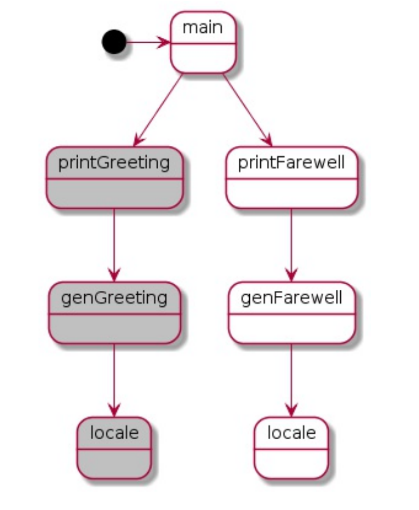
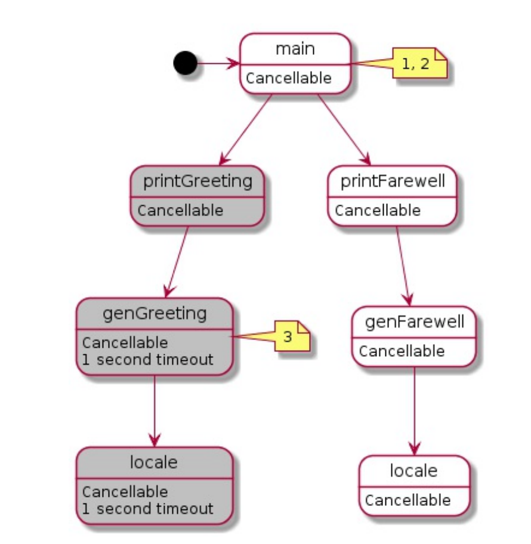

# Concurrency In Go

## 第4章 GO语言并发编程范式

### context包

在并发编程中,由于连接超时、用户取消或系统故障灯原因,往往需要执行抢占操作.我们之前使用`done` channel来在程序中取消所有阻塞的并发操作,虽然有不错的效果,但同样存在局限.

如果我们可以在取消时附加一些额外的信息(例如取消原因、操作是否正常完成等),这对我们进一步处理会起到非常大的帮助.

实际上在`done` channel中携带这种额外信息的需求是很普遍的.因此GO语言的作者们决定创建一个标准模式来实现这一点.它最初是一个独立于标准库的实验,但在Go 1.7中,`context`包被纳入标准库,使得这成为在处理并发代码时要考虑的标准Go习惯用法.

如果我们浏览一下`context`包,会发现其包含的内容非常少:

```go
var Canceled = errors.New("context canceled")

type CancelFunc func()
type Context interface {}

func Background() Context
func TODO() Context
func WithCancel(parent Context) (ctx Context, cancel CancelFunc)
func WithTimeout(parent Context, timeout time.Duration) (Context, CancelFunc)
func WithDeadline(parent Context, d time.Time) (Context, CancelFunc) 
func WithValue(parent Context, key, val any) Context
```

我们稍后会讨论这些类型和函数,现在我们重点关注`Context`类型.这个类型像`done` channel一样贯穿你的整个系统.如果使用`context`包,则从顶层的并发调用开始,每个下游函数都将以`Context`作为其第一个参数,该类型定义如下:

```go
type Context Interface {
	// 当为该Context工作的work被取消时,Deadline()方法将返回一个时间.
	// 当未设置截止时间时,则Deadline()方法的ok值为false.连续调用Deadline()方法将返回相同的结果
	Deadline() (deadline time.Time, ok bool)
	
	// Done()方法返回一个channel,当当前Context应该被取消时,
	// 则返回的channel会被关闭.若当前Context永远不会被取消,
	// 则Done()方法的返回值为nil.在cancel()函数返回之后,Done()方法
	// 返回的channel会异步关闭.
	// 调用WithCancel()函数返回的CancelFunc时,会安排Done()返回的
	// channel关闭;WithDeadline()函数在到达d时刻时会安排Done()返回
	// 的channel关闭;WithTimeout()函数在到达timeout时刻时会安排
	// Done()返回的channel关闭.
	// Done()方法主要用于select语句中:
	//  // Stream()函数通过调用DoSomething()函数生成值,并将这些值
	//  // 发送到out channel,直到DoSomething()函数返回错误或
	//  // ctx.Done()返回的channel被关闭
    //  func Stream(ctx context.Context, out chan<- Value) error {
	//  	for {
	//  		v, err := DoSomething(ctx)
	//  		if err != nil {
	//  			return err
	//  		}
	//  		select {
	//  		case <-ctx.Done():
	//  			return ctx.Err()
	//  		case out <- v:
	//  		}
	//  	}
	//  }
	//
	Done() <-chan struct{}
	
	// 若Done()方法返回的channel尚未关闭,则Err()方法将返回nil;
	// 若Done()方法返回的channel已关闭,则Err()方法将返回一个
	// 非空的error,该error用于解释原因:
	// 返回context.Canceled表示上下文被取消了;
	// 返回context.DeadlineExceeded表示上下文的运行时间到达了截止时刻
	// 当Err()方法返回一个非空的error之后,连续调用Err()函数会返回
	// 相同的结果
	Err() error
	
	// Value()方法返回当前上下文中与key关联的value,若没有与key对应
	// 的value,则返回nil.连续调用Value()函数将返回相同的结果
	
	// 上下文值仅用于在进程间或API间传递,而非用于将一个可选参数传递给函数
	
	// 在一个上下文中,每个key都标识着一个特定的value.希望将值存储在
	// 上下文的函数通常在全局变量中分配一个key,然后用这个key作为参数
	// 传递给context.WithValue()和context.Value().
	// key可以是任何支持比较的类型;为避免冲突,包应该将key定义为不可导出的类型
	
	//  // demo 包定义了一个 User 类型用于存储在上下文中
	//  package demo
	// 
	//  import "context"
	//
	//  // User 用于定义存储在Context中的值的类型
	//  type User struct{}
	// 
	//  // key 在包内定义的一个不可导出的类型.其目的在于为了防止在同一个上下文内,
	//  // 包外的代码使用字面量相同的键覆盖包内的键.单独定义类型,可以确保即使包外
	//  // 使用了相同的字面量,也不会导致键冲突,因为类型不同
	//  type key int
	// 
	//  // userKey 是 demo.User 类型的值所对应的键.该变量也是不可导出的
	//  // 客户端使用 demo.NewContext 和 demo.FromContext 函数来存取上下文中的值
	//  // 而非直接使用该键来存取上下文中的值
	//  var userKey key = 1
	//  
	//  // NewContext 返回一个新的包含了 user 的 Context
	//  func NewContext(ctx context.Context, user *User) context.Context {
	//  	return context.WithValue(ctx, userKey, user)
	//  }
	//
	//  // FromContext 从 ctx 中返回之前存储的 *User 类型的值,若之前未存储过,则返回的标量为false
	//  func FromContext(ctx context.Context) (*User, bool) {
	//  	value := ctx.Value(userKey)
	//  	user, ok := value.(*User)
	//  	return user, ok
	//  }
	Value(key any) any
}
```

这看起来比较简单.`Done()`返回一个channel,当我们的函数被抢占时,该channel会关闭.也有一些新的但易于理解的方法:`Deadline()`方法用于指示一个协程是否在一定时间后被取消,`Err()`方法在协程被取消时返回非空.但`Value()`方法看起来有些奇怪,它的作用是什么?

****

- 被抢占:当一个函数的上下文被取消或到达了截止时间时,该函数的执行被提前中止或中断.这种中断是由于外部原因导致的,比如超时、取消请求或其他错误条件.被抢占意味着正在执行的函数无法继续执行完毕,而是被迫提前结束.

****

GO语言的作者注意到,goroutine的主要用途之一是处理请求.通常在这种程序中,除了关于抢占的信息外,还需要传递与请求相关的信息.这就是`Value()`方法被设计出来的目的.稍后讨论这个问题,现在我们只需要知道,context包被设计出来是为了解决如下问题:

- 提供一个API,该API用于取消调用链上的分支
- 提供一个数据包,该数据包用于在请求范围内的调用链上传递数据

先来看第一个目的:取消操作

正如在本章前面的[防止goroutine泄露](https://github.com/rayallen20/ConcurrencyInGo/blob/master/note/%E7%AC%AC4%E7%AB%A0%20GO%E8%AF%AD%E8%A8%80%E5%B9%B6%E5%8F%91%E7%BC%96%E7%A8%8B%E8%8C%83%E5%BC%8F/3.%20%E9%98%B2%E6%AD%A2goroutine%E6%B3%84%E9%9C%B2.md)一节学到的,函数中的取消有3个方面:

- goroutine的父goroutine要取消它
- 一个goroutine可能想要取消它的子goroutine
- goroutine中的任何阻塞操作都必须是可抢占的,以便将该操作取消

context包可以帮助我们处理这三个方面的需求

正如之前提到的,`context.Context`类型要成为你函数的第1个参数.如果你查看`context.Context`接口上的方法,你会发现没有任何方法可以改变底层结构的状态.更进一步的说,没有任何方法允许接收`context.Context`的函数将这个`context.Context`取消.这样的设计保护了调用栈上层的函数可以不受子函数取消`context.Context`的影响.结合`Done()`方法提供的`done` channel,`context.Context`类型可以安全地管理来自上游函数的取消操作.

这就引发了一个问题:如果`context.Context`是不可变的,那在调用栈中,我们是如何在当前函数中影响其下游函数的取消行为?context包提供的一些函数回答了这个问题:

```go
func WithCancel(parent Context) (ctx Context, cancel CancelFunc)
func WithDeadline(parent Context, d time.Time) (Context, CancelFunc)
func WithTimeout(parent Context, timeout time.Duration) (Context, CancelFunc)
```

注意:这些函数都有一个`context.Context`类型作为入参,并返回一个新的`context.Context`实例.其中一些函数还接受其他参数,如`d`和`timeout`.这些函数根据传入的选项生成和该函数相关的新的`context.Context`实例.

- `WithCancel()`:返回一个新的`context.Context`,当调用返回的`cancel()`函数时,关闭其`done` channel
- `WithDeadline()`:返回一个新的`context.Context`,当机器的时钟超过给定的截止时间时,关闭其关闭其`done` channel
- `WithTimeout()`:返回一个新的`context.Context`,当经过给定的超时时间后,关闭其关闭其`done` channel

如果你的函数需要以某种方式取消调用链中的下游函数,则该函数需要调用这些函数之一并将返回的`context.Context`传递给其子函数.若你的函数不需要修改取消行为,则只需将入参的`context.Context`原样不动地传递给下游函数即可.

通过这种方式,调用链中的连续层级可以创建符合其需求的上下文,且不会影响到它们的父级.这种方式为管理调用链中的分支提供了一种可组合的、优雅的解决方案.

通过这种方式,`context.Context`实例可以贯穿你的整个程序.在面向对象范式中,通常会把常用数据存储为成员变量,重要的是千万不要对`context.Context`实例做这样的操作.从一个函数的外部视角来看,`context.Context`实例可能是等效的,但从内部视角来看,`context.Context`实例可能在每个栈帧中都会发生变化(例如`func A()`调用`func B()`时,使用的是`context.Background()`,而`func B()`调用`func C()`时使用了`context.WithTimeout()`,从而在A->B->C的调用链上,每个栈帧中的`context.Context`实例都有变化).因此,始终将`context.Context`实例传递给函数才是正确的做法.这样每个函数都有属于它自己的`context.Context`,而不是调用链上方N层的`context.Context`.

在异步调用图的顶部,你的代码可能没有传递一个`context.Context`实例.要启动这个调用链,`context`包提供了2个函数来创建空的`context.Context`实例:

```go
func Background() Context
func TODO() Context
```

`context.Background()`简单返回一个空的`context.Context`.`context.TODO()`并不是用于生产环境,但它也返回一个空的`context.Context`;`context.TODO()`的预期用途是作为一个占位符,当你不知道使用哪个`context.Context`,或者你期望你的代码被提供一个`context.Context`但上游代码尚未提供时,可以使用`context.TODO()`.

我们来看一个使用`done` channel的例子并和使用`context`包作比较,看看能够获得什么好处.这是一个同时打印问候和告别的程序:

```go
package main

import (
	"errors"
	"fmt"
	"sync"
	"time"
)

func main() {
	var wg sync.WaitGroup
	done := make(chan interface{})
	defer close(done)

	wg.Add(1)
	go func() {
		defer wg.Done()
		if err := printGreeting(done); err != nil {
			fmt.Printf("%v\n", err)
			return
		}
	}()

	wg.Add(1)
	go func() {
		defer wg.Done()
		if err := printFarewell(done); err != nil {
			fmt.Printf("%v\n", err)
			return
		}
	}()

	wg.Wait()
}

func printGreeting(done <-chan interface{}) error {
	greeting, err := genGreeting(done)
	if err != nil {
		return err
	}
	fmt.Printf("%s world!\n", greeting)
	return nil
}

func printFarewell(done <-chan interface{}) error {
	farewell, err := genFarewell(done)
	if err != nil {
		return err
	}
	fmt.Printf("%s world!\n", farewell)
	return nil
}

func genFarewell(done <-chan interface{}) (string, error) {
	switch language, err := locale(done); {
	case err != nil:
		return "", err
	case language == "EN/US":
		return "Goodbye", nil
	}
	return "", errors.New("unsupported language")
}

func genGreeting(done <-chan interface{}) (string, error) {
	switch language, err := locale(done); {
	case err != nil:
		return "", err
	case language == "EN/US":
		return "Hello", nil
	}
	return "", errors.New("unsupported language")
}

func locale(done <-chan interface{}) (string, error) {
	select {
	case <-done:
		return "", fmt.Errorf("canceled")
	case <-time.After(1 * time.Second):
	}
	return "EN/US", nil
}
```

运行结果:

```
go run greetingAndFarewellWithDoneChannel.go
Hello world!
Goodbye world!
```

不考虑竞态条件(我们可能在看到`Hello world!`前先看到`Goodbye world!`),可以看到在我们的程序中有2个分支同时在运行.通过创建一个`done` channel并将其传递到调用链中的方式,建立了标准的抢占方式,如果在`main()`函数中的任何地方关闭`done` channel,则2个分支都会被取消.

通过在`main()`函数中引入goroutine,我们打开了集中不同且有趣的方式来控制这个程序的可能性.我们可能希望`genGreeting()`在执行时间过长的情况时进行超时控制.我们可能不希望`genFarewell()`在我们知道其父级(`printFarewell()`)很快被取消时调用`locale()`.在每个栈帧中,函数可以影响其下的所有调用栈.

使用`done` channel的模式,我们可以通过将传入的`done` channel封装到其他的`done` channel,然后在任何一个`done` channel触发时返回的方式实现"函数可以影响其下的所有调用栈"的需求.但我们无法得知像`context.Context`提供的关于截止时间和错误的额外信息.

为了更容易地比较`done` channel模式和`context`包之间的区别,我们将这个程序表示为一棵树.树中的每个节点表示一个函数的调用.



使用`context`包来修改这个程序.由于现在有了context.Context的灵活性,我们可以引入一个有趣的场景.

假设`genGreeting()`想要在放弃调用`locale()`前等待1秒(即:`genGreeting()`调用`locale()`的超时时间为1秒).我们还想在`main()`函数中添加一些逻辑:如果`printGreeting()`不成功,我们还想取消对`printFarewell()`的调用.毕竟如果我们不打招呼,那么说再见就没有意义了!

```go
package main

import (
	"context"
	"fmt"
	"sync"
	"time"
)

func main() {
	var wg sync.WaitGroup
	ctx, cancel := context.WithCancel(context.Background())
	defer cancel()

	wg.Add(1)
	go func() {
		defer wg.Done()
		if err := printGreeting(ctx); err != nil {
			fmt.Printf("can not print greeting: %v\n", err)
			cancel()
		}
	}()

	wg.Add(1)
	go func() {
		defer wg.Done()
		if err := printFarewell(ctx); err != nil {
			fmt.Printf("can not print farewell: %v\n", err)
		}
	}()

	wg.Wait()
}

func printGreeting(ctx context.Context) error {
	greeting, err := genGreeting(ctx)
	if err != nil {
		return err
	}
	fmt.Printf("%s world!\n", greeting)
	return nil
}

func genGreeting(ctx context.Context) (string, error) {
	ctx, cancel := context.WithTimeout(ctx, 1*time.Second)
	defer cancel()

	switch language, err := locale(ctx); {
	case err != nil:
		return "", err
	case language == "EN/US":
		return "Hello", nil
	}
	return "", fmt.Errorf("unsupported language")
}

func printFarewell(ctx context.Context) error {
	farewell, err := genFarewell(ctx)
	if err != nil {
		return err
	}
	fmt.Printf("%s world!\n", farewell)
	return nil
}

func genFarewell(ctx context.Context) (string, error) {
	switch language, err := locale(ctx); {
	case err != nil:
		return "", err
	case language == "EN/US":
		return "Goodbye", nil
	}
	return "", fmt.Errorf("unsupported language")
}

func locale(ctx context.Context) (string, error) {
	select {
	case <-ctx.Done():
		return "", ctx.Err()
	case <-time.After(1 * time.Minute):
	}
	return "EN/US", nil
}
```

运行结果:

```
go run greetingAndFarewellWithContext.go
can not print greeting: context deadline exceeded
can not print farewell: context canceled
```

1. 第12行:`ctx, cancel := context.WithCancel(context.Background())`.此处使用`context.Background()`来创建一个`context.Context`实例,并使用`context.WithCancel()`封装它,使它允许被取消.
2. 第20行:`cancel()`.此处如果调用`printGreeting()`发生错误,则`main()`函数将取消该`context.Context`,确保在该`context.Context`被传递范围内的所有函数都能被抢占(实现了"如果`printGreeting()`不成功,我们还想取消对`printFarewell()`的调用"的需求)
3. 第45行:`ctx, cancel := context.WithTimeout(ctx, 1*time.Second)`.此处`genGreeting()`使用`context.WithTimeout()`将它的`context.Context`包装起来.这将在1秒后自动取消返回的`context.Context`,从而取消所有它的子级`context.Context`,本例中即为`locale()`函数.实现了"`genGreeting()`调用`locale()`的超时时间为1秒"的需求.
4. 第79行:`return "", ctx.Err()`.这一行返回`context.Context`被取消的原因.这个错误会一直冒泡到`main()`函数,这会导致第20行的`cancel()`被调用.

下面的图中数字对应例子中的代码标注:



从输出结果可以看出,系统运行正常.因为我们确定`locale()`至少运行1分钟,因此`genGreeting()`中调用`locale()`将始终超时,这意味着`main()`函数将始终取消`printGreeting()`以下的调用链.

注意`genGreeting()`是如何构建一个定制的`context.Context`以满足其需求且不会影响到其父级(`printGreeting()`)的`context.Context`.如果`genGreeting()`成功返回,且`printGreeting()`需要进行另外一个调用,这种做法可以确保不会泄露`genGreeting()`操作的信息.这种可组合型可以使你在编写大型系统时,不需要混合关注点且能够贯穿整个调用链.

我们可以对这个程序进一步改进:因为我们知道`locale()`大约需要1分钟的运行时间,所以可以在`locale()`中我们可以检查是否设置了截止时间,以及是否能够能够按时完成.下面的示例演示了如何使用`context.Context`的`Deadline()`方法进行检查:

```go
package main

import (
	"context"
	"fmt"
	"sync"
	"time"
)

func main() {
	var wg sync.WaitGroup
	ctx, cancel := context.WithCancel(context.Background())
	defer cancel()

	wg.Add(1)
	go func() {
		defer wg.Done()
		if err := printGreeting(ctx); err != nil {
			fmt.Printf("can not print greeting: %v\n", err)
			cancel()
		}
	}()

	wg.Add(1)
	go func() {
		defer wg.Done()
		if err := printFarewell(ctx); err != nil {
			fmt.Printf("can not print farewell: %v\n", err)
		}
	}()

	wg.Wait()
}

func printGreeting(ctx context.Context) error {
	greeting, err := genGreeting(ctx)
	if err != nil {
		return err
	}
	fmt.Printf("%s world!\n", greeting)
	return nil
}

func genGreeting(ctx context.Context) (string, error) {
	ctx, cancel := context.WithTimeout(ctx, 1*time.Second)
	defer cancel()

	switch language, err := locale(ctx); {
	case err != nil:
		return "", err
	case language == "EN/US":
		return "Hello", nil
	}
	return "", fmt.Errorf("unsupported language")
}

func printFarewell(ctx context.Context) error {
	farewell, err := genFarewell(ctx)
	if err != nil {
		return err
	}
	fmt.Printf("%s world!\n", farewell)
	return nil
}

func genFarewell(ctx context.Context) (string, error) {
	switch language, err := locale(ctx); {
	case err != nil:
		return "", err
	case language == "EN/US":
		return "Goodbye", nil
	}
	return "", fmt.Errorf("unsupported language")
}

func locale(ctx context.Context) (string, error) {
	if deadline, ok := ctx.Deadline(); ok {
		// 预计运行完毕时刻 = 当前时刻 + 1分钟
		// deadline时刻 - (预计运行完毕时刻) <= 0 意味着会超时 则不运行
		if deadline.Sub(time.Now().Add(1*time.Minute)) <= 0 {
			return "", context.DeadlineExceeded
		}
	}

	select {
	case <-ctx.Done():
		return "", ctx.Err()
	case <-time.After(1 * time.Minute):
	}
	return "EN/US", nil
}
```

运行结果:

```
go run greetingAndFarewellWithDeadline.go 
can not print greeting: context deadline exceeded
can not print farewell: context canceled
```

- 第77行:`if deadline, ok := ctx.Deadline(); ok`.此处检查了`locale()`的`context.Context`是否被预设了deadline.若提供了,且`locale()`的运行时间已经超过了deadline时间,则简单返回一个`context`包预设的错误`context.DeadlineExceeded`.

虽然修改的部分很少,但现在它允许`locale()`快速失败.在可能要调用的下一个函数是开销很大(假设`locale()`还会调用`Foo()`且`Foo()`的开销很大)的程序中,这样做可以节省大量时间.至少这种做法允许函数立刻失败,而不必等待实际的超时发生.唯一的问题在于,你必须对下层调用链所需时长有所了解,这可能是一个非常困难的任务.

这就引入了`context`包的另一部分功能:用于存储和读取请求范围内的数据.记住,通常情况下,当函数创建一个goroutine和`context.Context`时,它就是在启动一个处理请求的过程,而调用栈中更深层次的函数可能需要关于请求的信息.下面是如何在`context.Context`中存储数据并读取数据的示例:

```go
package main

import (
	"context"
	"fmt"
)

func main() {
	ProcessRequest("jane", "abc123")
}

func ProcessRequest(userId, authToken string) {
	ctx := context.WithValue(context.Background(), "userId", userId)
	ctx = context.WithValue(ctx, "authToken", authToken)
	HandleResponse(ctx)
}

func HandleResponse(ctx context.Context) {
	userId := ctx.Value("userId").(string)
	authToken := ctx.Value("authToken").(string)

	fmt.Printf("Handling response for %v (%v)\n", userId, authToken)
}
```

运行结果:

```
go run storeAndRetrieveInContext.go 
Handling response for jane (abc123)
```

非常简单的东西.唯一的限制是:

- 你使用的键必须满足GO语言的可比性概念,即使用`==`和`!=`时需要返回正确的结果
- `ctx.Value()`返回的值必须是并发安全的,这样才能从多个goroutine安全地访问

首先,`context`包的作者推荐你在你的包中自定义key的类型.这样无论其他包是否也自定义了key的类型,都可以防止`context`中的冲突.为了提醒你为什么需要这么做,我们来看一个简短的程序,该程序试图在一个map中存储具有不同类型但具有相同底层值的key:

```go
package main

import "fmt"

type foo int

type bar int

func main() {
	m := make(map[interface{}]int, 2)
	m[foo(1)] = 1
	m[bar(1)] = 2
	fmt.Printf("%#v\n", m)
}
```

运行结果:

```
go run sameValueDiffType.go 
map[interface {}]int{1:2, 1:1}
```

可以看到,当基础值相同但key的类型不同时,map是可以区分它们的.因为你定义的key的类型是不可导出的,因此其他包是不会和你在包内生成的key冲突的.

由于我们存储数据的key是不可导出的,因此我们必须通过导出函数来读取value.这也非常方便,因为它允许数据的消费者使用静态的、类型安全的函数.

组合这些因素,你会得到下面的例子:

```go
package main

import (
	"context"
	"fmt"
)

type ctxKey int

const (
	ctxUserID ctxKey = iota
	ctxAuthToken
)

func main() {
	ProcessRequest("jane", "abc123")
}

func ProcessRequest(userId, authToken string) {
	ctx := context.WithValue(context.Background(), ctxUserID, userId)
	ctx = context.WithValue(ctx, ctxAuthToken, authToken)
	HandleResponse(ctx)
}

func HandleResponse(ctx context.Context) {
	fmt.Printf(
		"Handling response for %v (%v)\n",
		UserId(ctx),
		AuthToken(ctx),
	)
}

func UserId(ctx context.Context) string {
	return ctx.Value(ctxUserID).(string)
}

func AuthToken(ctx context.Context) string {
	return ctx.Value(ctxAuthToken).(string)
}
```

运行结果:

```
go run storeAndRetrieveInContextWithCustomKey.go 
Handling response for jane (abc123)
```

本例中我们使用类型安全的方法从`context.Context`中获取值,且如果数据的消费者在不同的包中,他们也不需要知道用于存储的key具体是什么.但是,这种技术存在问题.

本例中,假设`HandleResponse()`确实位于一个名为`response`的另一个包中,而`ProcessRequest()`位于一个名为`process`的包中,那么`process`包则不得不导入`response`包以便调用`HandleResponse()`,而`HandleResponse()`又需要访问`process`包中定义的访问器函数(本例中即为`process.UserId()`和`process.AuthToken()`),因此造成了循环依赖,由于在`context.Context`中存储的key,其类型是`process`包是私有的,导致`response`包无法读取`context.Context`中的数据!

```
 tree ./
./
├── main.go
├── process
│   └── processRequest.go
└── response
    └── handleResponse.go

2 directories, 3 files
```

`process/processRequest.go`:

```go
package process

import (
	"code/chapter4/42-storeAndRetrieveInContextWithCustomKey/ctxCustomKey/response"
	"context"
)

type ctxKey int

const (
	ctxUserID ctxKey = iota
	ctxAuthToken
)

func ProcessRequest(userId, authToken string) {
	ctx := context.WithValue(context.Background(), ctxUserID, userId)
	ctx = context.WithValue(ctx, ctxAuthToken, authToken)
	response.HandleResponse(ctx)
}

func UserId(ctx context.Context) string {
	return ctx.Value(ctxUserID).(string)
}

func AuthToken(ctx context.Context) string {
	return ctx.Value(ctxAuthToken).(string)
}
```

`response/handleResponse.go`:

```go
package response

import (
	"code/chapter4/42-storeAndRetrieveInContextWithCustomKey/ctxCustomKey/process"
	"context"
	"fmt"
)

func HandleResponse(ctx context.Context) {
	fmt.Printf(
		"Handling response for %v (%v)\n",
		process.UserId(ctx),
		process.AuthToken(ctx),
	)
}
```

`main.go`:

```go
package main

import "code/chapter4/42-storeAndRetrieveInContextWithCustomKey/ctxCustomKey/process"

func main() {
	process.ProcessRequest("jane", "abc123")
}
```

运行结果:

```
go run main.go 
package command-line-arguments
        imports code/chapter4/42-storeAndRetrieveInContextWithCustomKey/ctxCustomKey/process
        imports code/chapter4/42-storeAndRetrieveInContextWithCustomKey/ctxCustomKey/response
        imports code/chapter4/42-storeAndRetrieveInContextWithCustomKey/ctxCustomKey/process: import cycle not allowed
```

这迫使代码的组织结构以数据类型为中心,并且从多个位置导入这些数据类型.这当然不是一件坏事,只是需要注意这一点.

```
tree ./
./
├── main.go
└── storeAndRetrive
    ├── defineKey.go
    ├── handleResponse.go
    └── processRequest.go

1 directory, 4 files
```

`storeAndRetrive/defineKey.go`:

```go
package storeAndRetrive

type ctxKey int

const (
	ctxUserID ctxKey = iota
	ctxAuthToken
)
```

`storeAndRetrive/handleResponse.go`:

```go
package storeAndRetrive

import (
	"context"
	"fmt"
)

func HandleResponse(ctx context.Context) {
	fmt.Printf(
		"Handling response for %v (%v)\n",
		UserId(ctx),
		AuthToken(ctx),
	)
}
```

`storeAndRetrive/processRequest.go`:

```go
package storeAndRetrive

import (
	"context"
)

func ProcessRequest(userId, authToken string) {
	ctx := context.WithValue(context.Background(), ctxUserID, userId)
	ctx = context.WithValue(ctx, ctxAuthToken, authToken)
	HandleResponse(ctx)
}

func UserId(ctx context.Context) string {
	return ctx.Value(ctxUserID).(string)
}

func AuthToken(ctx context.Context) string {
	return ctx.Value(ctxAuthToken).(string)
}
```

`main.go`:

```go
package main

import "code/chapter4/42-storeAndRetrieveInContextWithCustomKey/ctxCustomKeyDefine/storeAndRetrive"

func main() {
	storeAndRetrive.ProcessRequest("jane", "abc123")
}
```

`context`包非常方便,但褒贬不一.在GO社区中,`context`包在某种程度上引起了争议.这个包的取消功能得到了广泛赞赏,但在`context.Context`中存储任意数据的能力以及不安全的存储方式引起了一些分歧.尽管我们通过访问器函数的方式可以部分地解决类型安全的问题,但仍然可能通过存储不正确的类型引入错误.然而更大的问题肯定是开发人员到底应该在`context.Context`中存储什么类型的数据.

在`context`包的文档中这样写到:

```
将 context 值仅用于在进程和 API 之间传递的请求范围数据
```

这个说明实在太过宽泛."请求范围数据"是什么?或许指的是与特定请求或操作相关的数据?它包括在处理请求期间所需的信息,并可能在不同的进程或API边界之间传递?但这个描述的范围实在太大了.我发现最好的做法是和团队一起制定自己的准则,并在代码审查的过程中进行评估.这些准则应有助于确定并定义`context.Context`中存储的值的使用方式,确保他们用于请求范围数据而非用于可选参数.以下是我的建议:

1. **数据应该在进程或API边界之间传递**.如果你在进程内部生成数据并将这些数据存储在内存中,那么这些数据可能不适合作为请求范围的数据,除非你通过API边界传递这些数据
2. **数据应该是不可变的**.如果数据可变,那么更具定义,你存储的数据就不是来自请求的
3. **数据应该趋向简单类型**.如果请求范围数据意味着要在进程间和API边界之间传输,那么对方要拉取这些数据将会容易很多,因为对方不需要导入一系列复杂的包
4. **数据应该是纯粹的数据,而非是某种类型的方法**.消费者的逻辑应该是消耗这些数据
5. **数据应该修饰操作,而非驱动操作**.如果你的算法根据从`context.Context`中消费到不同的数据而表现出不同的行为,那么可能这些数据已经转移到了可选参数的范围

以上皆非硬性规定,只是用来启发你编程时的思维建议.但是如果你发现在`context.Context`中存储的数据违反了上述5条准则,你可能需要仔细观察你的决策了.

另一个需要考虑的因素是:该数据被使用之前,需要经过多少层.如果在接收数据和使用数据之间存在几个框架和几十个函数,你是倾向于使用冗长、自说明的函数签名,并将数据作为参数添加为参数添加?还是你更愿意将数据放入`context.Context`中,从而创建一个隐式的依赖关系?每种方法都有其有点,最终是你和你的团队需要作出的决策.


即使有了这些启发式准则,判断一个值是否属于请求范围的数据仍然是一个难题.下面的表格列出了我对每种类型数据是否符合我列出的五个启发式准则的观点.你同意吗?

|数据|应该在进程或API边界之间传递|数据应该是不可变的|数据应该趋向简单类型|数据应该是纯粹的数据而非是某种类型的方法|数据应该修饰操作而非驱动操作|
|:-:|:-:|:-:|:-:|:-:|:-:|
|Request ID|√|√|√|√|√|
|User ID|√|√|√|√||
|URL|√|√||||
|API Server Connection||||||
|Authorization Token|√|√|√|√||
|Request Token|√|√|√|||

有时很明显某些东西不应该存储在`context.Context`中.比如API Server Connection.但有时这个界限又没那么清晰.那么Authorization Token是否应该存储在`context.Context`中呢?它是不可变的,很可能它是一个`[]bytes`,但它不符合第5条(数据应该修饰操作而非驱动操作),因为接收者使用它来决定是否处理请求.这种数据应该存储在`context.Context`中吗?更让人困惑的是,在一个团队中被接受的做法可能在另一个团队中不被接受.

总而言之,这个问题并没有一个标准答案.`context`包已经被纳入标准库,因此你必须对其使用方式形成一些意见,但这些意见可能(也应该)会根据你接触的项目而变化.我能给你的最后建议是,`context.Context`提供的取消功能非常有用,你对数据包的看法不应该阻止你使用它.