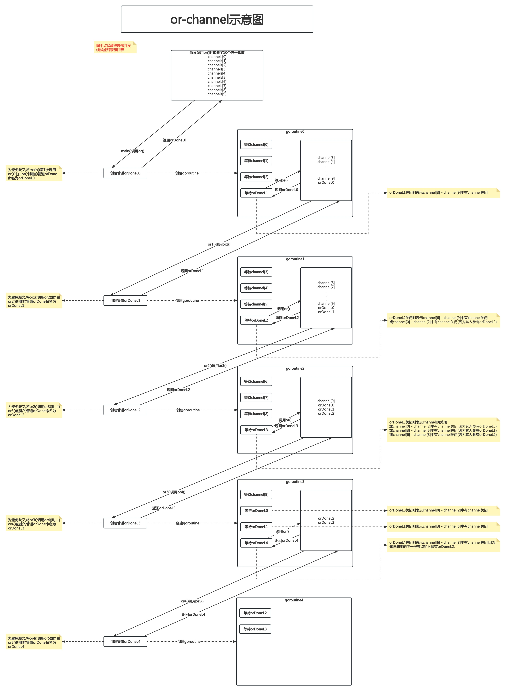

# Concurrency In Go

## 第4章 GO语言并发编程范式

### or-channel

有时你可能希望将多个信号管道`done`合并成1个复合信号管道.当这个复合信号管道中的任何一个管道关闭时,该复合管道也关闭.写一个`select`代码块来执行这种耦合是完全可行的,虽然会有些冗长.但你在运行时并不知道这个复合管道中到底有多少个信号管道`done`.这种情况下,如果你希望通过1行代码来解决这个问题,可以使用or-channel的模式将这些信号管道组合在一起.

这种模式通过递归和goroutine创建一个复合的信号管道:

```go
package main

func main() {
}

func or(channels ...<-chan interface{}) <-chan interface{} {
	switch len(channels) {
	// 没有信号管道 直接返回
	case 0:
		return nil
	// 只有1个信号管道 返回该信号管道
	case 1:
		return channels[0]
	}

	orDone := make(chan interface{})
	// 有2个或以上的信号管道
	go func() {
		defer close(orDone)

		switch len(channels) {
		// 有2个信号管道
		case 2:
			select {
			case <-channels[0]:
			case <-channels[1]:
			}

		// 有2个以上的信号管道
		default:
			select {
			case <-channels[0]:
			case <-channels[1]:
			case <-channels[2]:
			case <-or(append(channels[3:], orDone)...):
			}
		}
	}()

	return orDone
}
```

- 第6行:`func or(channels ...<-chan interface{}) <-chan interface{}`.创建了一个名为`or`的函数.该函数接收的参数类型为可变数量的只读空接口管道,该函数返回值类型为1个只读空接口管道.
- 第9行:`case 0:`.由于函数`or()`是一个递归函数,因此要设置递归的基准条件.第1个基准条件为:若传入的可变长参数为nil,则返回一个nil管道.这和不传管道的想法是一致的:我们不希望复合通道做任何事.
- 第12行:`case 1:`.第2个基准条件为:若只传入了1个信号管道,则将该信号管道返回.
- 第18行:`go func()`.这是函数`or()`最重要的部分,也是递归产生的地方.此处创建了一个goroutine,以便可以不被阻塞地等待复合管道中每一个信号管道中消息的到来
- 第23行:`case 2:`.由于我们是递归调用`or()`函数的,所以当代码能运行到这个分支时,说明我们至少给`or()`函数传递了2个管道.为了将goroutine的数量限制在一定的范围内(这也是一种优化手段),此处将"传递了2个管道"作为一种特殊情况处理
- 第30行:`default:`.此处我们从输入的多个channel中的第3个channel开始,递归地创建一个or-channel,在这个递归的过程中形成了一个树形结构,这个树形结构由剩余的管道构成.递归操作会逐层累计直到返回第1个信号管道.为了确保当树形结构中顶层的goroutine退出时底层的goroutine也能退出,在其中传递了一个管道`orDone`.



在上图中,假设传入给函数`or()`的所有信号管道中,有任何一个能够读取或关闭,则树形结构中所有的goroutine也会随之关闭.

此处假设图中的`channel[8]`关闭.


每一个goroutine创建的`orDone`管道,既会作为返回值返回给调用方,以便当该管道关闭时调用方(树形结构中该goroutine上方的goroutine)能够解除阻塞;也会作为实参传递给该goroutine创建的goroutine,以便当该管道关闭时,树形结构中该goroutine下方的goroutine能够解除阻塞

这个函数相当简洁,它使得你可以传入任意数量的信号管道,当这些管道中的任何一个有写入或者被关闭时,该函数和它递归创建的所有goroutine都会结束运行.

下面是一个使用该函数的例子,在该例子中,经过一段时间后会关闭管道,然后使用`or()`函数将这些管道合并到1个管道中,在传入的所有管道中的任何一个关闭时,这个合并后的管道会被关闭.

```go
package main

import (
	"fmt"
	"time"
)

func main() {
	start := time.Now()
	<-or(
		sig(2*time.Hour),
		sig(5*time.Minute),
		sig(1*time.Second),
		sig(1*time.Hour),
		sig(1*time.Minute),
	)

	fmt.Printf("done after %v\n", time.Since(start))
}

func or(channels ...<-chan interface{}) <-chan interface{} {
	switch len(channels) {
	case 0:
		return nil
	case 1:
		return channels[0]
	}

	orDone := make(chan interface{})
	go func() {
		defer close(orDone)

		switch len(channels) {
		case 2:
			select {
			case <-channels[0]:
			case <-channels[1]:
			}

		default:
			select {
			case <-channels[0]:
			case <-channels[1]:
			case <-channels[2]:
			case <-or(append(channels[3:], orDone)...):
			}
		}
	}()

	return orDone
}

func sig(after time.Duration) <-chan interface{} {
	c := make(chan interface{})
	go func() {
		defer close(c)
		time.Sleep(after)
	}()

	return c
}
```

- 第53行:`func sig(after time.Duration) <-chan interface{}`.该函数只是创建了一个管道,该管道在经过指定的时间(`after`)后将会被关闭
- 第9行:`start := time.Now()`.此处设置一个起始时间,该时间为自`or()`函数返回的管道开始阻塞的时间
- 第18行:`fmt.Printf("done after %v\n", time.Since(start))`.此处打印的是阻塞持续的时间

虽然在调用`or()`的时候传入了多个在不同时长后才会被关闭的管道,但因为"1s之后关闭的管道"被关闭(第62行`sig(1*time.Second)`),导致所有被`or()`创建的管道都被关闭了.

在本例中,我们以创建`f(x) = x/2`(其中x是传入的channel的数量)个goroutine为代价实现了代码的简洁性.

**这种模式在你系统中的模块交汇点非常有用.在这个交汇点上,你往往需要检查很多个条件来取消goroutine树.而使用`or()`函数,则将这些条件组合在一起传递给`or()`函数即可.**