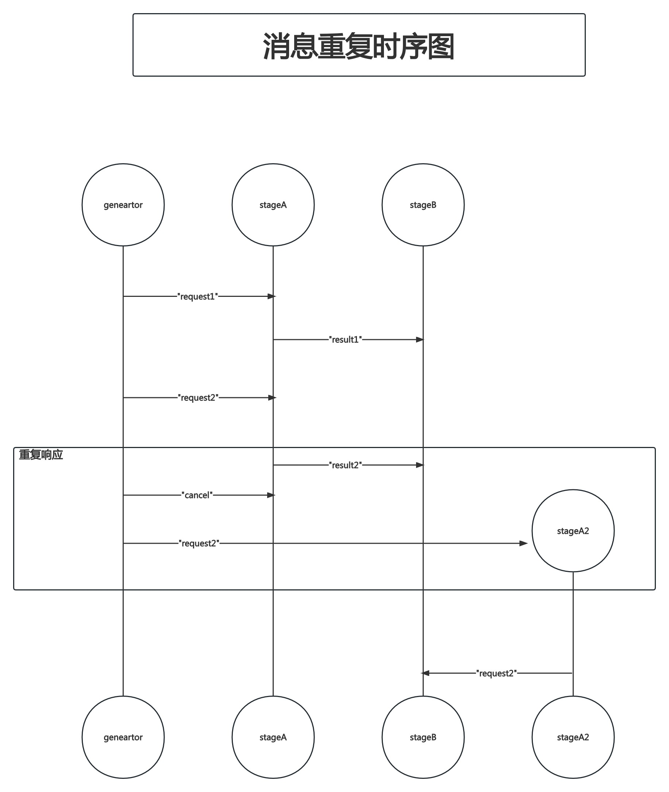
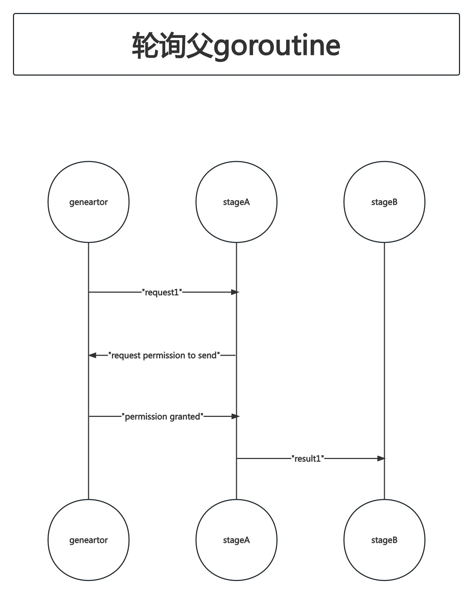

# Concurrency In Go

## 第5章 大规模并发

### 超时和取消

在编写并发代码时,超时(Timeouts)和取消(Cancellation)是频繁出现的两种操作.我们将在本节中看到,超时对于创建一个行为可理解的系统至关重要.取消是对超时的一种很自然的响应.我们还将探讨并发过程可能被取消的其他原因.

为什么我们的并发过程要支持超时呢?

##### 系统饱和

正如我们在[队列排队](https://github.com/rayallen20/ConcurrencyInGo/blob/master/note/%E7%AC%AC4%E7%AB%A0%20GO%E8%AF%AD%E8%A8%80%E5%B9%B6%E5%8F%91%E7%BC%96%E7%A8%8B%E8%8C%83%E5%BC%8F/11.%20%E9%98%9F%E5%88%97%E6%8E%92%E9%98%9F.md)一节中讲到的,如果我们的系统已经饱和(即:已经到达其处理请求的能力极限),我们希望超出其处理能力范围的请求超时而不是花费很长的时间去等待.具体选择超时还是等待取决于你的实际业务,以下是一些关于何时该超时的一般性指导:

- 当发生超时的情况时,请求不太可能重复发送
- 没有资源可以用于存储请求(例如临时队列的内存满了;持久队列的磁盘空间满了)
- 如果对系统的响应或请求中的数据有时效性要求(后续将讨论这个问题).如果超时的请求可能会重复发送,那么你的系统会因为接收和超时请求而产生额外的开销.如果这个开销超过了系统的容量,将会产生一个死亡螺旋.但是,如果我们没有足够的系统资源用于将请求存储在队列中,这一点就没有意义了.即使符合了上述两个指导方针,也没有必要将一个还未处理就已经过期的请求放入队列.这给我们带来了支持超时的下一个理由

##### 过期数据

有时数据会带有一个时间窗口,只有在这个窗口期内处理相关数据才被认为是有效的,如果过了这个时间窗口再处理这些数据,则被判定为处理已经过期.如果一个并发进程处理数据所需的时间比这个窗口期更长,我希望超时并取消这个并发进程.例如,如果我们的并发进程需要经过很长时间的等待之后才能出队一个请求,那么在排队的过程中可能请求或请求中的数据已经过期了.

如果事先知道这个窗口的时长,那么可以使用`context.WithDeadline()`或`context.WithTimeout()`创建一个具有超时控制的`context.Context`并传递给并发处理过程.如果事前不知道这个窗口的长度,那么我们希望并发过程的父级能够在不再需要处理这个请求时取消这个并发过程.`context.WithCancel()`适用于这个场景.

##### 防止死锁

在大型系统中,尤其是大型分布式系统中,理解数据的流动方向或者可能出现的边缘情况是比较困难的.在所有的并发操作上加超时是合理的甚至是推荐的,其目的在于为了保障系统不会出现死锁.超时时间不一定要接近并发操作的执行时间.设置超时时间的目的仅仅是为了防止死锁,因此这个时间只需要足够短,以便死锁的部分在合理的时间内解除阻塞即可.

我们在[并发概述-死锁、活锁与饥饿](https://github.com/rayallen20/ConcurrencyInGo/blob/master/note/%E7%AC%AC1%E7%AB%A0%20%E5%B9%B6%E5%8F%91%E6%A6%82%E8%BF%B0/%E7%AC%AC1%E7%AB%A0%20%E5%B9%B6%E5%8F%91%E6%A6%82%E8%BF%B0.md#%E6%AD%BB%E9%94%81%E6%B4%BB%E9%94%81%E5%92%8C%E9%A5%A5%E9%A5%BF)章节中提到过,通过设置超时来避免死锁的方式有可能会将问题从死锁变为活锁.然而在一个大型的系统中,会有着更多的组件在同时运作,因此系统的时间表相比于上一次发生死锁时,有更大的概率是不同的.因此,相比发生死锁并只能通过重启的方式来恢复的情况,我们可能更愿意接受的是冒着活锁的风险,并在时间允许的情况下进行修复.

****

此处的"时间表"原文是"timing profile".指的是系统在不同时间点上的行为、性能、响应时间等特征.在大型系统中,由于各种因素的影响,系统的工作负载、网络延迟、资源利用情况等可能会随着时间发生变化.因此,系统的"timing profile"可能会随着时间的推移而变化,这也意味着系统在不同时间点上可能会出现不同的性能问题和挑战.通过设置超时来避免死锁是一种尝试预防系统在特定时刻发生阻塞的策略,以适应系统在不同时间点上的不确定性和变化.

****

注意,这并不是一个关于如何正确构建系统的建议.而是关于构建一个对时间错误有容忍的建议,而这些时间错误在开发和测试期间你可能并不容易遇到.我建议你保持超时,但超时的目的是为了构建一个没有死锁且不触发超时的系统.

现在我们已经了解何时使用超时,让我们将注意力转向取消的原因以及如何构建一个用于优雅地处理取消的并发进程.并发过程被取消的原因有很多:

##### 超时

超时是一种隐式取消.

##### 用户干预

在良好的用户体验下,通常建议并发地启动一个长时间运行的进程(维持一个长链接),该进程以间隔轮询的方式向用户报告状态,或者允许用户根据需要自行查询状态.因此,当存在面向用户的并发操作时,有时还要允许用户取消他们启动的操作.

##### 父级取消

事实上,如果并发操作的任何类型的父级(无论是人还是代码)停止,作为该父级的子级,也应该被停止.

##### 复制请求

我们可能希望将数据发送到多个并发进程,以便尝试从最快的一个进程中获得相应.当收到第一个进程的返回时,我们希望可以取消其他进程的执行.我们会在[复制请求]()这一节中详细讨论这个问题.

可能还有其他原因.但"为什么被取消"不如"如何取消"那么困难和有趣.在[第4章 并发编程范式](https://github.com/rayallen20/ConcurrencyInGo/tree/master/note/%E7%AC%AC4%E7%AB%A0%20GO%E8%AF%AD%E8%A8%80%E5%B9%B6%E5%8F%91%E7%BC%96%E7%A8%8B%E8%8C%83%E5%BC%8F)部分,我们探讨了2中取消并发进程的方式:`done` channel和`context.Context`.但那只是简单的方式.此处我们要探讨一个更复杂的问题:当一个并发进程被取消时,对于正在执行的算法,及其下游的消费者而言,会发生什么?在编写可以随时都会被终止的并发代码时,你需要考虑哪些事项?

为了回答这些问题,我们需要探讨的第1个问题是并发进程的可抢占性.假设以下代码在自己的goroutine中运行:

```go
package main

import "time"

func main() {

}

func runInGoroutine(done <-chan interface{}, valueStream <-chan interface{}) {
	var value interface{}
	resultStream := make(chan interface{})

	select {
	case <-done:
		return
	case value = <-valueStream:
	}

	result := reallyLongCalculation(value)

	select {
	case <-done:
		return
	case resultStream <- result:
	}
}

func reallyLongCalculation(value interface{}) interface{} {
	time.Sleep(3 * time.Second)
	return value
}
```

我们已经把"从`valueStream`中读取"和"写入到`resultStream`"这两个操作给耦合起来了,还检查了`done` channel以便确认goroutine是否被取消,但我们仍然有一个问题.`reallyLongCalculation()`不是可抢占的,而且通过名字可知,它需要执行很长时间!这意味着当`reallyLongCalculation()`正在执行时,有些东西试图取消这个goroutine,那么这个东西需要等很长时间才能响应取消并停止执行,我们将`reallyLongCalculation()`改写为可抢占的,看看会发生什么:

```go
package main

import "time"

func main() {

}

func runInGoroutine(done <-chan interface{}, valueStream <-chan interface{}) {
	var value interface{}
	resultStream := make(chan interface{})

	select {
	case <-done:
		return
	case value = <-valueStream:
	}

	result := reallyLongCalculation(done, value)

	select {
	case <-done:
		return
	case resultStream <- result:
	}
}

func reallyLongCalculation(done <-chan interface{}, value interface{}) interface{} {
	intermediateResult := longCalculation(value)
	select {
	case <-done:
		return nil
	default:
	}

	return longCalculation(intermediateResult)
}

func longCalculation(value interface{}) interface{} {
	time.Sleep(3 * time.Second)
	return value
}
```

****

TODO:`reallyLongCalculation()`调用了2次`longCalculation()`,且2次传的参数是不一样的,这样的做法我认为会对最终结果产生影响.例如`longCalculation()`功能是对`value`进行`+1`的操作,那么调用了2次的话,结果就不对了.

****

我们已经取得了一些进展:`reallyLongCaluclation()`现在是可抢占的,但是我们可以看到我们只解决了一半问题:我们只能在`reallyLongCaluclation()`调用其他运行时间较长的函数之间抢占`reallyLongCaluclation()`,为了解决这个问题,我们还需要让`longCalculation()`是可抢占的:

```go
package main

import "time"

func main() {

}

func runInGoroutine(done <-chan interface{}, valueStream <-chan interface{}) {
	var value interface{}
	resultStream := make(chan interface{})

	select {
	case <-done:
		return
	case value = <-valueStream:
	}

	result := reallyLongCalculation(done, value)

	select {
	case <-done:
		return
	case resultStream <- result:
	}
}

func reallyLongCalculation(done <-chan interface{}, value interface{}) interface{} {
	intermediateResult := longCalculation(done, value)
	return longCalculation(done, intermediateResult)
}

func longCalculation(done <-chan interface{}, value interface{}) interface{} {
	select {
	case <-done:
		return nil
	default:
	}
	time.Sleep(3 * time.Second)
	return value
}
```

如果按照这种方式推理,可以得出2个结论:

- 定义并发编程可抢占的时间段
- 确保耗时比这个时间段长的功能是可抢占的

一个简单的方法是将你的goroutine分解为更小的部分.你应该让所有不可抢占的原子操作在你认为可接受的时间段内完成.

这里还潜藏着另一个问题:如果我们的goroutine恰好修改了共享状态(例如数据库、文件、内存数据结构),那么当goroutine被取消时会发生什么?你的goroutine是否应该尝试将这些中间状态的工作回滚?goroutine有多长时间用于执行回滚?因为某些原因告诉goroutine该停止工作,所以goroutine不应该花费太长时间用于回滚,对吗?

很难给出关于处理这种问题的通用建议,因为你算法的性质决定你该如何处理这种情况;但是,如果你将共享状态的修改限制在一个比较紧密的范围,并确保这些修改很容易回滚,通常都可以很好的处理取消操作.如果可能的话,先在内存中建立一个用于存储中间结果的临时存储,然后尽快地修改状态.以下例子是一个错误示范:

```go
package main

import "fmt"

func main() {
	result := add(1, 2, 3)
	writeTallyToState(result)

	result = add(4, 5, 6)
	writeTallyToState(result)

	result = add(7, 8, 9)
	writeTallyToState(result)
}

func add(values ...int) int {
	result := 0
	for _, value := range values {
		result += value
	}

	return result
}

func writeTallyToState(tally int) {
	// 此处使用fmt.Sprintf来模拟一个写入操作
	content := fmt.Sprintf("Tally is %v\n", tally)
	fmt.Printf(content)
}
```

本例中我们执行了3次写操作.如果在最后一次写操作之前,运行这段代码的goroutine被取消,那么就需要有一种方法能回滚前2次的写入,用以下方式对比上述方式:

```go
package main

import "fmt"

func main() {
	result := add(1, 2, 3, 4, 5, 6, 7, 8, 9)
	writeTallyToState(result)
}

func add(values ...int) int {
	result := 0
	for _, value := range values {
		result += value
	}

	return result
}

func writeTallyToState(tally int) {
	// 此处使用fmt.Sprintf来模拟一个写入操作
	content := fmt.Sprintf("Tally is %v\n", tally)
	fmt.Printf(content)
}
```

这种方式下,我们需要处理回滚的范围就小了很多.如果在我们调用`writeTallyToState()`之后发生了取消操作,我们仍然需要一种方法来撤销我们的更改,但这种情况发生的概率很小,因为我们只修改了1次状态.

你还需要关注的另一个问题是消息重复.假设你有一个由3个阶段组成的pipeline:`generator()`、`stageA()`、`stageB()`.`generator()`阶段通过自上次从channel中读取数据的时长来监控`stageA()`阶段.若当前监控的`stageA()`阶段不正常,则创建一个新的实例`A2`.这种情况下,`stageB()`可能会收到重复的消息,如下图示:



从时序图中可以看到,如果在`stageA()`向`stageB()`发送结果之后,`stageA()`才接收到取消操作的信号,那么`stageB()`可能会收到重复的消息.

有很多种方法可以避免重复发送消息.最简单的(也是最推荐的)方法是在子goroutine报告结果后,父goroutine不再发送取消信号.这需要各个阶段之间双向通信,我们将在[心跳]()一节详细介绍.其他方法有:

##### 接收第一个或最后一个上报的结果

如果你的算法允许,或你的并发过程是幂等的,你可以允许在下游过程中有可能出现消息重复,并选择接收上报给你的第一个或最后一个消息

##### 轮询父goroutine检查权限

你可以让子goroutine和父goroutine双向通信,当子goroutine需要向下游发送数据时,先向父goroutine确认是否能够将消息发送至下游.这种方法类似于心跳机制.如下图示.



因为我们显式地请求写入`stageB`的channel的权限,因此这比心跳机制更安全.但在实践中很少这么干,因为这种方式比心跳机制更复杂,且心跳机制更加通用且有效,因此建议只使用心跳机制即可.

在设计并发编程时,一定要考虑超时和取消.就像软件工程中许多的其他技术问题一样,如果从一开始就忽视超时和取消,然后再试图在后期添加它们,就有点像在烘焙完成后的蛋糕中添加鸡蛋了.