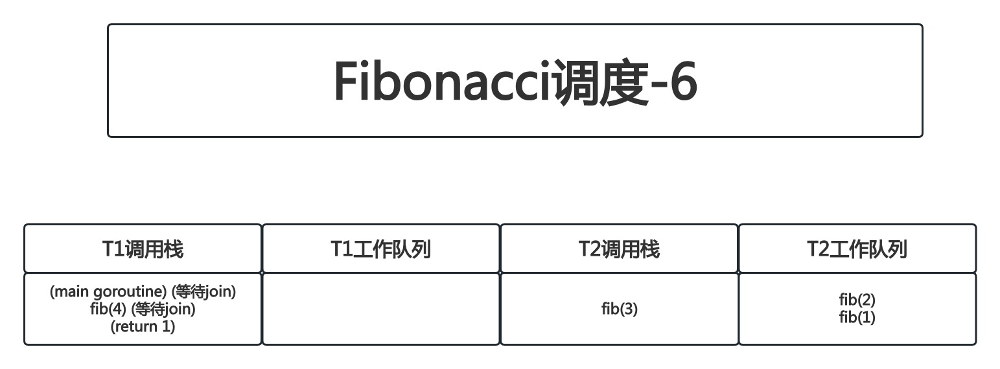

# Concurrency In Go

## 第6章 goroutine和GO语言运行时

### 工作窃取

正如[如何帮助你](https://github.com/rayallen20/ConcurrencyInGo/blob/master/note/%E7%AC%AC2%E7%AB%A0%20%E5%AF%B9%E4%BD%A0%E7%9A%84%E4%BB%A3%E7%A0%81%E5%BB%BA%E6%A8%A1-%E9%80%9A%E4%BF%A1%E9%A1%BA%E5%BA%8F%E8%BF%9B%E7%A8%8B/%E7%AC%AC2%E7%AB%A0%20%E5%AF%B9%E4%BD%A0%E7%9A%84%E4%BB%A3%E7%A0%81%E5%BB%BA%E6%A8%A1-%E9%80%9A%E4%BF%A1%E9%A1%BA%E5%BA%8F%E8%BF%9B%E7%A8%8B.md#%E5%A6%82%E4%BD%95%E5%B8%AE%E5%8A%A9%E4%BD%A0)和[goroutine](https://github.com/rayallen20/ConcurrencyInGo/blob/master/note/%E7%AC%AC3%E7%AB%A0%20GO%E8%AF%AD%E8%A8%80%E5%B9%B6%E5%8F%91%E7%BB%84%E4%BB%B6/1.%20goroutine.md)两节中讨论的那样,GO语言会自动将goroutine多路复用到操作系统线程上.它使用的算法被称为工作窃取策略.这是什么意思?

首先,我们来看一下在多处理器之间共享工作的朴素策略,这种策略被称为公平调度(fair scheduling).为了确保所有处理器被平均利用,我们将负载平均分配给所有可用的处理器.假设有`n`个处理器和`x`个任务要执行.在公平调度策略下,则每个处理器都会分配到`x/n`个任务.

```
<计划任务1>
<计划任务2>
<计划任务3>
<计划任务4>
```


不过这种策略存在问题.想想[goroutine](https://github.com/rayallen20/ConcurrencyInGo/blob/master/note/%E7%AC%AC3%E7%AB%A0%20GO%E8%AF%AD%E8%A8%80%E5%B9%B6%E5%8F%91%E7%BB%84%E4%BB%B6/1.%20goroutine.md)一节中讲到的fork-join模型.在一个fork-join的范例中,任务与任务之间是可能彼此依赖的,基于刚刚说过的朴素策略来分配任务可能会导致某个处理器的利用率不足.不仅如此,还可能导致CPU本地缓存利用率较差,因为需要使用同样数据的任务被调度到了其他处理器上.让我们来看一个示例.

假设有一个很简单的程序,假设此时有4个计划任务,仍旧按照上述调度策略来分配任务.但此例子中,`<计划任务2>`的所需的时间比`<计划任务1> + <计划任务3>`所需的时长还要常,会发生什么?


设第`n`秒时开始执行任务,任务1所需时长为`a`秒,任务2所需时长为`a + b`秒,任务3所需时长小于`b`秒

|时间|Processor1|Processor2|
|:-:|:-:|:-:|
|n|任务1|任务2|
|n + a|任务3|任务2|
|n + a + b|空闲|任务4|

可以看到,无论`a`和`b`的时长为多少,都会导致`Processor1`的空闲

若任务之间存在依赖关系,即:分配给一个处理器的任务需要依赖分配在另一个处理器上的任务的的执行结果,会发生什么情况呢?例如:任务1依赖任务4的结果:


设第`n`秒时开始执行任务,任务1所需时长为`d`秒,任务2所需时长为`a + b`秒,任务4所需时长为`c`秒:

|时间|Processor1|Processor2|
|:-:|:-:|:-:|
|n|任务1|任务2|
|n + a|阻塞|任务2|
|n + a + b|阻塞|任务4|
|n + a + b + c|任务1|空闲|
|n + a + b + c + d|任务3|空闲|

在这种情况下,Processor1完全空闲的同时,Processor2正在处理任务2和任务4.当Processor1被阻塞在任务1上时,Processor2正在被任务2占用,Processor1本可以处理任务4以解除Processor1的阻塞的.

这个负载均衡问题可以用一个FIFO的队列来解决.工作任务被调度到队列中,处理器在空闲时将工作任务出队或者在阻塞时将任务入队.这是我们要讨论的第一种工作窃取算法,这种算法能够解决问题吗?


答案是可能会解决.相对于简单的将任务平均分配给处理器,这种方法会更好一些.因为它解决了处理器利用率底下的问题.但是这种方式引入了一个所有处理器都必须使用的一个集中式数据结构.就像在[内存访问同步](https://github.com/rayallen20/ConcurrencyInGo/blob/master/note/%E7%AC%AC1%E7%AB%A0%20%E5%B9%B6%E5%8F%91%E6%A6%82%E8%BF%B0/%E7%AC%AC1%E7%AB%A0%20%E5%B9%B6%E5%8F%91%E6%A6%82%E8%BF%B0.md#%E5%86%85%E5%AD%98%E8%AE%BF%E9%97%AE%E5%90%8C%E6%AD%A5)一节中介绍的,频繁地进入和退出临界区的成本是非常昂贵的.不仅如此,CPU本地缓存利用率较差的问题只会加剧:每当任何一个处理器想要将任务入队或出队时,都需要将这个集中队列重新加载到每个CPU中.对于粗粒度的操作,这可能是一个有效的方法.但是,goroutine通常不是粗粒度的,因此集中式队列可能不是我们任务调度算法的最佳选择.

接下来可以将这个集中队列分散化.我们可以为每个处理器提供属于它自己的线程和一个双端队列,如下图示:


The next leap we could make is to decentralize the work queues. We could give each processor its own thread and a double-ended queue, or deque like this:

下一步我们可以采取的方法是将工作队列分散化。我们可以为每个处理器提供自己的线程和双端队列（deque）,就像这样：


现在解决了高度争用下数据结构过于集中的问题,但缓存局部性的问题和处理器利用率的问题怎么解决?而且,假设任务在Porcessor1上开始,且所有fork出的任务都被放在了Porcessor1的的队列中,那么这些任务该如何传递到Porcessor2呢?并且假如任务被移动到了Porcessor2上,会不会有上下文切换的问题?让我们来看看分布式队列的工作窃取算法,看看它的运行.

GO语言采用fork-join模型进行并发处理.fork表示启动goroutine,join点表示使用channel或sync包中的类型对2个或多个goroutine进行同步.更通俗的讲,fork这个词指的是在程序中的任意一点,它可以将执行的子分支与其父节点同时运行.join这个词指的是在将来某个时候,这些并发执行的分支将会合并在一起.工作窃取算法遵循一些基本原则,对于给定的线程而言:

1. 在fork点,将被fork出来的任务添加到与线程关联的双端队列的尾部
2. 若线程空闲,则随机选取一个线程,从与该线程关联的双端队列头部窃取工作
3. 若join点尚未到达(例如:当前线程中的goroutine已经完成,但与其同步的goroutine尚未完成),则将线程关联的双端队列尾部的任务弹出
4. 若线程的双端队列为空,则:
	1. 在join点处暂停
	2. 随机选取一个线程,并从该线程关联的双端队列头部窃取任务

只讲规则有点抽象,让我们看一些实际的代码,观察这个调度算法的运转.下面是一个递归计算斐波那契数列的程序:

```go
package main

import "fmt"

func main() {
	fmt.Printf("fib(4) = %d\n", <-fib(4))
}

func fib(n int) <-chan int {
	result := make(chan int)

	go func() {
		defer close(result)

		if n <= 2 {
			result <- 1
			return
		}

		result <- <-fib(n-1) + <-fib(n-2)
	}()

	return result
}
```

让我们来看看按照上述规则的工作窃取算法是如何在这个GO程序中运转的.假定这段程序运行在一个虚拟的机器上,该机器有2个单核处理器.我们将在每个处理器上生成1个系统线程,T1表示Processor1的系统线程,T2表示Processor2的系统线程.在我们讲解这个例子时,将会在T1和T2之间切换,以提供一些实际的结构.在实际运行中,这个过程是不确定的.

程序开始运行了.最初只有1个goroutine,即main goroutine,假设main goroutine被调度到了Processor1上:


|T1调用栈|T1工作队列|T2调用栈|T2工作队列|
|:-:|:-:|:-:|:-:|
|(main goroutine)||||

接下来将调用`fib(4)`.这个goroutine将被防止在T1关联的双端队列的尾部,同时父级goroutine将继续处理:

|T1调用栈|T1工作队列|T2调用栈|T2工作队列|
|:-:|:-:|:-:|:-:|
|(main goroutine)|`fib(4)`|||

此时,根据时机不同,以下2种情况之一将会发生:T1或T2将窃取运行`fib(4)`的goroutine.本例中为了更清楚地说明算法,我们假设T1窃取成功;但是,需要记住一点:任何一个线程都有成功窃取的可能性.


`fib(4)`在T1上运行,且由于加法的操作顺序是从左到右,因此会将`fib(3)`和`fib(2)`推入T1的双端队列的尾部.


此时,T2仍处于空闲状态,因此它从T1的双端队列头部窃取了`fib(3)`.注意,`fib(2)`是`fib(4)`推入队列的最后一个任务,因此T1最有可能需要计算的第1个任务仍然在T1上.稍后将讨论为什么这一点很重要


与此同时,T1无法继续计算`fib(4)`,因为`fib(4)`正在等待`fib(3)`和`fib(2)`返回的channel.这是算法第三步中尚未实现的join点.因此,T1从自己的双端队列尾部弹出一个任务,即`fib(2)`


这里有点令人困惑.因为我们在递归算法中没有使用回溯,而是安排一个新的goroutine来计算`fib(2)`.计算`fib(2)`的goroutine是一个新的、与刚刚在T1上调度的goroutine(我理解是计算`fib(4)`的goroutine)完全分离的goroutine.刚刚在T1上调度的goroutine是计算`fib(4)`的一部分(假设称为4-2,我理解是T1上计算`fib(2)`的goroutine);而新的goroutine是计算`fib(3)`的goroutine的一部分(假设称为3-1,我理解是T2上计算`fib(3)`的goroutine产生的goroutine).以下是调用`fib(3)`产生的goroutine:


接下来,T1到达递归斐波那契算法的基本情况(`n ≤ 2`),因此`fib(2)`返回1.



然后,T2到达了一个尚未实现的join点,因此继续从T2的双端队列尾部弹出一个任务(即`fib(1)`)


现在,T1再次处于空闲状态,因此它从T2的工作队列中窃取任务


T2到达递归斐波那契算法的基本情况(`n ≤ 2`),因此`fib(1)`返回1.


然后,T1也到达递归斐波那契算法的基本情况(`n ≤ 2`),因此`fib(2)`返回1.


T2上调用的`fib(3)`现在已经有2个实现的join点;也就是说对于`fib(2)`和`fib(1)`的调用已经在在他们各自的channel上返回了结果,且`fib(3)`产生的这两个goroutine已经join到它们的父goroutine(即计算`fib(3)`的goroutine)中.计算`fib(3)`的goroutine执行加法操作(`1 + 1 = 2`)并将结果`2`返回到它的channel上


同样的情况再次发生:计算`fib(4)`的goroutine有2个未实现的join点:`fib(3)`和`fib(2)`.上一步完成了对计算`fib(3)`的goroutine的join(计算`fib(2)`的goroutine和计算`fib(1)`的goroutine join到了计算`fib(3)`的goroutine上);在T2上计算`fib(3)`的goroutine完成时,计算`fib(2)`的goroutine也完成了join.因此再次执行加法操作(`2 + 1 = 3`),并将结果`3`返回到计算`fib(4)`的goroutine的channel上


此时,main goroutine的join点(`<- fib(4)`)也已经实现了,因此main goroutine也可以继续执行,它将打印结果以完成执行:


现在让我们来看一下这个算法的一些有趣特性,回想一下,执行任务的线程既可以从它的双端队列的尾部推入任务,(在必要时)也可以从尾部弹出任务.位于双端队列尾部的任务具有以下特性:

- 这个任务最有可能是可以让父级goroutine完成join的任务

更快地完成join意味着程序的性能会更好,并且需要在内存中保存的内容也越少

- 这个任务最有可能是在当前处理器上仍有缓存的任务

因为该任务是线程在开始当前任务之前执行的最后一个任务,因此很可能它所需要的信息仍在线程所对应的CPU的缓存中.这意味着缓存不命中的次数更少!

总体来讲,这种任务调度方式在性能上有很多隐含的好处.